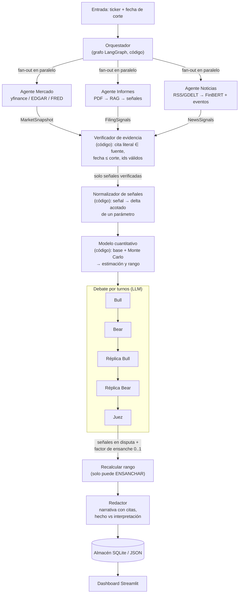

# Analista de empresa multiagente — arquitectura propuesta

Sistema local y open source que, dado un ticker y una fecha de corte, recoge datos numéricos,
informes (PDF) y noticias, convierte lo cualitativo en **señales estructuradas y verificadas**,
las traduce a **ajustes acotados** de un modelo cuantitativo, y deja el resultado (estimación +
rango de confianza + narrativa con citas) en un dashboard.

> Herramienta de análisis, no de recomendación de inversión. El dashboard debe decirlo.

## Principio de diseño

**El LLM extrae y argumenta; el código calcula y decide.** Ningún número final ni rango de
confianza sale de lo que un modelo pequeño "cree". Las señales del LLM entran al modelo
cuantitativo solo como ajustes acotados (clip), y solo si su cita literal se verifica contra
la fuente.

## Diagrama



## Agentes y contratos

Cada agente escribe **solo su propia clave** del estado compartido (modelos Pydantic), y su
salida se valida antes de pasar al siguiente nodo. Si no valida: reintento acotado, y si sigue
fallando, la clave queda vacía con motivo — no se inventa nada.

| Nodo | ¿LLM? | Entra | Sale | Notas |
|---|---|---|---|---|
| Orquestador | No | ticker, fecha de corte | plan + presupuesto de llamadas | Fan-out con la API `Send` de LangGraph, timeouts, reintentos |
| Mercado | Casi no | ticker | `MarketSnapshot`: precios, ratios, fundamentales, volatilidad | Sobre todo herramientas; el LLM solo resume tendencias si hace falta |
| Informes | Sí | PDF(s) | `FilingSignals`: guidance, riesgos, tendencia por segmento, cada uno con `evidence` literal + página | Reutiliza chunking jerárquico + FAISS/reranker de AInstein; map-reduce por secciones para caber en contexto |
| Noticias | FinBERT + LLM | RSS/GDELT | `NewsSignals`: sentimiento, tipo de evento, materialidad, fecha, URL | Deduplicar antes; FinBERT clasifica, el LLM solo etiqueta eventos |
| Verificador | No | todas las señales | señales verificadas + descartadas con motivo | Aquí vive la lección de AInstein: una cita entre comillas se comprueba contra el texto real |
| Normalizador | No | señales verificadas | `Adjustments`: parámetro → delta con tope | Tabla explícita y versionada (p. ej. guidance a la baja → crecimiento entre −X y 0) |
| Modelo cuantitativo | No | snapshot + ajustes | estimación + distribución + rango | DCF simple o regresión + Monte Carlo; el rango sale de la dispersión de los datos |
| Bull / Bear | Sí | paquete de evidencia + salida del modelo | argumento con referencias a ids de señal | Solo pueden citar ids que existan en el paquete |
| Juez | Sí | debate completo | señales en disputa + factor de ensanche (0–1) | Salida acotada: nunca mueve la estimación puntual, solo puede ensanchar el rango |
| Redactor | Sí | todo lo anterior | informe con secciones "los datos dicen" / "mi interpretación" | Mismo etiquetado que `paper-analysis` |
| Dashboard | No | almacén | vistas: precio, señales con su evidencia, rango, debate | Streamlit; cada señal enlaza a su cita original |

## Estado compartido (esquema)

```
AnalysisState
├─ request:        ticker, cutoff_date
├─ market:         MarketSnapshot | None
├─ filings:        list[FilingSignal]
├─ news:           list[NewsSignal]
├─ verified:       list[Signal]       # pasan el verificador
├─ rejected:       list[(Signal, motivo)]
├─ adjustments:    Adjustments
├─ model_output:   {point, low, high, params}
├─ debate:         list[Turn]
├─ verdict:        {disputed_ids, widen_factor}
├─ report:         Report
└─ budget:         llamadas usadas por nodo
```

## Qué patrones multiagente practica

- **Fan-out / fan-in** paralelo (tres analistas de fuente) con espera de todos.
- **Orquestador determinista** en vez de un LLM supervisor.
- **Salida estructurada** con validación y reintento acotado.
- **Verificador/guardarraíl** entre agentes (cada agente desconfía del anterior).
- **Debate por turnos** con juez y salida acotada (el tramo de "turnos" de la serie).
- **Presupuesto de llamadas por nodo**, con el mismo enfoque de límites impuestos en código.

## Modelos por nodo (configurable)

- Extracción de informes y etiquetado de eventos: modelo pequeño (p. ej. `qwen3.5:4b`).
- Sentimiento de noticias: FinBERT local (más fiable y barato que un LLM para esto).
- Bull/Bear/Juez: idealmente un modelo algo mayor si el equipo lo permite; comparar con el 4B
  es en sí mismo un experimento medible.

## Estructura de repo sugerida

```
company-analyst/
├─ agents/         market.py  filings.py  news.py  debate.py  reporter.py
├─ core/           state.py (Pydantic)  verifier.py  normalizer.py  budget.py
├─ quant/          model.py (DCF/regresión)  montecarlo.py
├─ data/           edgar.py  yfinance_source.py  rss.py  filings_rag.py
├─ graph.py        # StateGraph: fan-out → verificar → normalizar → modelo → debate → informe
├─ dashboard/      app.py (Streamlit)
├─ eval/           extraction_eval.py  verifier_tests.py  scripted_debate_tests.py
└─ tests/
```

## Plan por hitos (cada uno ejecutable y probado antes del siguiente)

1. **Solo Mercado + modelo cuantitativo + dashboard**, sin ningún LLM. Valida datos, modelo y
   rango con una empresa. Si esto no es sólido, nada de lo demás lo arregla.
2. **Agente Informes** sobre un único 10-K, con verificador. Medir cuántas señales pasan y
   cuántas se descartan por cita inexistente.
3. **Agente Noticias** con FinBERT; evaluar contra Financial PhraseBank / FiQA.
4. **Normalizador** con la tabla de ajustes y comprobar que los topes se respetan (test
   determinista, sin modelo, igual que `tests/test_skill_limits.py`).
5. **Debate + juez** probado primero con un modelo simulado (respuestas guionizadas) para
   validar el grafo y la salida acotada antes de meter LLMs reales.
6. **Redactor** y pulido del dashboard.

## Riesgos y cómo se mitigan

- **Sesgo de look-ahead:** evaluar la extracción, no la predicción; fijar la fecha de corte y
  descartar cualquier fuente posterior (el verificador ya comprueba `fecha ≤ corte`).
- **Tablas de PDF destrozadas al convertir:** números duros de EDGAR/yfinance; el PDF se usa
  para lo cualitativo.
- **`yfinance` inestable:** capa de datos con caché y una fuente alternativa (EDGAR).
- **Citas fabricadas por el modelo pequeño:** el verificador las descarta; nada sin cita
  verificada llega al modelo cuantitativo.
- **Parecer consejo financiero:** aviso explícito en el dashboard y en el informe.
