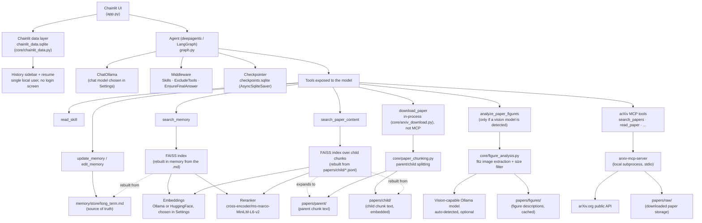

# AInstein

A 100% local AI research agent. It runs on [Ollama](https://ollama.com) and/or HuggingFace models you already have installed locally — the same models you might already be using for other local AI projects — with no calls to external APIs and no paid API keys required.

This project is under active development — this README reflects what is implemented and tested today, not a final vision.

Two optional companion apps, each its own local Streamlit server — separate from this chat app and from each other on request, not pages of one bigger dashboard:

**Observability dashboard**: turn-by-turn metrics, tool usage/success charts, model comparison, activity over time. `streamlit run observability/dashboard.py` (port 8020) — [http://localhost:8020](http://localhost:8020) once running.

**Knowledge graph**: a 3D interactive graph of papers/authors/topics extracted from long-term memory. `streamlit run memory/graph_app.py` (port 8030) — [http://localhost:8030](http://localhost:8030) once running.

Both get a one-click header button inside the chat app itself once they're running (see `.chainlit/config.toml`'s `header_links` — "Observability Dashboard" and "GraphRAG").

## Table of contents

- [Goal](#goal)
- [Vision](#vision)
- [Current status](#current-status)
- [Architecture](#architecture)
- [Tools](#tools)
- [Tech stack](#tech-stack)
- [Prerequisites](#prerequisites)
- [Installation](#installation)
- [Chat configuration](#chat-configuration)
- [Project structure](#project-structure)
- [How memory works](#how-memory-works)
- [How paper-content RAG works](#how-paper-content-rag-works)
- [arXiv integration](#arxiv-integration)
- [Why build the paper pipeline ourselves](#why-build-the-paper-pipeline-ourselves)
- [Known limitations](#known-limitations)
- [Roadmap](#roadmap)

## Goal

Build a personal research assistant that can search, retrieve, and reason over academic papers (starting with arXiv), while remembering the context of an ongoing research thread across sessions — all running entirely on the user's own machine, on models they choose and already have installed, with no research data ever leaving the device.

Beyond the assistant itself, this project exists to actually learn — hands-on, not just in theory — how to:

- Manage "public" MCP servers locally, and work around the fact that they tend to be buggier and less polished than closed, API-key-gated ones.
- Manage memory in a local setup, both short-term (conversation state) and long-term (persistent, structured, searchable).
- Learn how to manage and build memory graphs in local environments.
- Build RAG pipelines over different kinds of underlying structure, not just one fixed content shape.
- Learn the real limitations of small local models firsthand — worse tool use, worse answers, infinite loops around tool calls, etc. — instead of assuming a bigger model would just make the problem disappear.
- Manage model traceability/observability — local in this project specifically, but the approach should generalize beyond local setups.
- Build a multimodal document-analysis pipeline. OCR (via Tesseract) recovers text from scanned/image-only PDFs, and `analyze_paper_figures` describes embedded figures/diagrams/charts with a local vision model, when one is available — see [Tools](#tools). Both are optional, auto-detected capabilities, not required setup.
- Manage a repository structure for correctly storing external documents (papers, in this case) through their proper stages — raw, processed, etc. — instead of collapsing everything into one flat blob.
- Build a set of skills for hands-on paper analysis, with the ability to personalize the strategies used, since different users may want to focus on different things from a paper — `paper-analysis` (quick/standard/extended depth modes) covers this; see [Tools](#tools).

## Vision

A personal research agent that:

- Searches and downloads papers from arXiv on demand.
- Maintains a local repository of papers already found/analyzed.
- Answers questions by citing concrete fragments from those papers (RAG over the actual content, not just metadata).
- Remembers the active research topic, user preferences, and relevant papers already seen, across sessions.
- Runs entirely locally — no dependency on paid APIs, no data sent to third parties.

## Current status

| Piece | Status |
|---|---|
| Local chat with Ollama (chainlit + langchain/langgraph) | ✅ Implemented |
| Agent via `deepagents` (`create_deep_agent`), with fine-grained control over which tools the model sees | ✅ Implemented |
| Skills system (progressive disclosure) | ✅ Implemented — 3 workflow skills (`memory-management`, `arxiv-research`, `citation-tracking`) plus `paper-analysis`, a depth-adjustable content-analysis skill (quick/standard/extended, fact-vs-interpretation labeling) adapted from two public MIT-licensed skills — see [Tools](#tools) and [Goal](#goal). `paper-analysis` specifically verified live through 5 rounds against `qwen3.5:4b`, finding and fixing two real small-model quirks along the way — see [Known limitations](#known-limitations). |
| Persistent conversation memory (SQLite checkpointer) | ✅ Implemented |
| Chat history sidebar + resuming past conversations | ✅ Implemented (Chainlit data layer, SQLite; single local user, no login screen) |
| Automatic conversation summarization to avoid saturating the context | ✅ Implemented |
| Editable long-term memory (preferences, active topic, papers) | ✅ Implemented |
| RAG over long-term memory (FAISS + reranker) | ✅ Implemented |
| Local model catalog (Ollama + HuggingFace cache) | ✅ Implemented |
| Error handling with short user-facing messages | ✅ Implemented |
| Per-turn metrics logging (tokens, timings, tools used) | ✅ Implemented |
| Observability dashboard (compare metrics across runs/models) | ✅ Implemented — separate local Streamlit app (`observability/`): turns table, tool usage/success charts, model comparison, activity over time (see intro above) |
| Knowledge graph (papers/authors/topics, 3D interactive) | ✅ Implemented — separate local Streamlit app (`memory/graph_app.py`), built from `memory/knowledge_graph.py` (see intro above) |
| Agent build caching (no full rebuild on every message) | ✅ Implemented |
| arXiv paper search and reading (via MCP) | ✅ Implemented |
| arXiv paper download | ✅ Implemented — in-process (`core/arxiv_download.py`), not via MCP; see [Tools](#tools) |
| Local repository of downloaded papers | ✅ Implemented (`papers/raw/`, written by `download_paper`) |
| RAG over paper content | ✅ Implemented — hierarchical parent/child chunking (`core/paper_chunking.py`) + FAISS/reranker search over child chunks, expanded to parent chunks for context (`search_paper_content`); see [How paper-content RAG works](#how-paper-content-rag-works) |
| Multimodal — OCR (image → text for scanned/text-less PDFs) | ✅ Implemented (optional) — Tesseract OCR, built into `pymupdf4llm` and used transparently when available |
| Multimodal — figure/diagram analysis | ✅ Implemented (optional) — `analyze_paper_figures` extracts embedded figures via `fitz` and describes them with a local vision-capable Ollama model, auto-detected when available. Verified live end-to-end against a real paper and a real model (`qwen3.5`) — see [Known limitations](#known-limitations) for a real `reasoning`-mode bug this surfaced and fixed. |
| Memory graph (relationships between papers/topics) | ⏳ Pending |
| Execution of HuggingFace models (beyond cataloging them) | ⏳ Pending (embeddings yes, text generation no) |

## Architecture



The model **never** has access to generic filesystem tools (`read_file`, `write_file`, `edit_file`, `ls`, `glob`, `grep`, `execute`) or subagents (`task`) — these are explicitly hidden via `ExcludeToolsMiddleware`. Everything the model can read or write goes through purpose-scoped tools (`read_skill`, `update_memory`, `edit_memory`, `search_memory`), each restricted to a single folder or file.

## Tools

| Tool | Purpose | Notes |
|---|---|---|
| `read_skill(skill_name, file_name="SKILL.md")` | Reads a skill's full instructions, or a supporting file it references. | Scoped to `skills/<skill_name>/` — cannot read anything outside it. Skills: `memory-management`, `arxiv-research`, `citation-tracking`, `paper-analysis`. |
| `update_memory(content, category)` | Adds a new long-term memory entry. | `category` is one of `preference`, `research_topic`, `keyword`, `paper`, `note`. Only ever touches `memory/store/long_term.md`. |
| `edit_memory(entry_id, content=None, category=None, delete=False)` | Replaces, corrects, or deletes an existing memory entry. | Affects exactly one entry, located by id — never rewrites the rest of the file. |
| `search_memory(query, k=5)` | Semantic search over long-term memory. | Retrieves up to 15 candidates via FAISS, reranks them with a cross-encoder, returns the top `k`. |
| `search_paper_content(query, paper_id=None, k=5)` | Semantic search over the full text of downloaded papers — not just abstracts. | Searches child chunks via FAISS + reranker, returns their parent chunks (deduped), each labeled with the paper's title/authors/arXiv id. Restrict to one paper with `paper_id`. See [How paper-content RAG works](#how-paper-content-rag-works). |
| `search_papers(query, max_results, date_from, date_to, categories, sort_by)` | Searches arXiv by keywords/filters. | arXiv MCP tool. Rate-limited to arXiv's own policy. |
| `get_abstract(paper_id)` | Fetches a paper's abstract and metadata without downloading it. | arXiv MCP tool. |
| `download_paper(paper_id, start, max_chars)` | Downloads a paper's full text (LaTeX source preferred for real section structure, then HTML, then PDF conversion as last resort) into `papers/raw/`, and splits it into parent/child chunks for `search_paper_content`. | Runs in-process (`core/arxiv_download.py`), not through the MCP server — the MCP round-trip for this specific tool was found to hang unpredictably (minutes, or indefinitely) even when the same fetch/convert logic run directly completes in under a minute. |
| `read_paper(paper_id, start, max_chars)` | Reads a paper previously saved with `download_paper`. | arXiv MCP tool. |
| `analyze_paper_figures(paper_id)` | Extracts and describes the figures/diagrams/charts embedded in a paper's PDF, using a local vision-capable model. | Only present when a vision-capable Ollama model is auto-detected (`core/figure_analysis.py`); fetches its own PDF copy regardless of which format `download_paper` used for the text. Results cached at `papers/figures/<paper_id>.jsonl`. |
| `list_papers()` | Lists all papers downloaded so far. | arXiv MCP tool. |
| `citation_graph(paper_id)` | Papers that cite, and are cited by, a given paper. | arXiv MCP tool, via Semantic Scholar. |
| `watch_topic(topic, categories, max_results)` | Saves a persistent arXiv search to monitor for new papers. | arXiv MCP tool. |
| `check_alerts(topic)` | Checks saved topic watches for newly published papers. | arXiv MCP tool. |

**Explicitly hidden from the model**: `ls`, `read_file`, `write_file`, `edit_file`, `glob`, `grep`, `execute`, `task` — the generic filesystem and subagent-launching tools `deepagents` registers by default (see [Architecture](#architecture)).

## Tech stack

- **UI / chat server**: [Chainlit](https://chainlit.io)
- **Agent orchestration**: [LangGraph](https://langchain-ai.github.io/langgraph/) + [`deepagents`](https://github.com/langchain-ai/deepagents) (skills, memory, auto-summarization, and filesystem middleware)
- **Local LLM**: [Ollama](https://ollama.com) via `langchain-ollama`. HuggingFace local models were evaluated as a second chat-model option but aren't supported yet — see [Known limitations](#known-limitations).
- **Embeddings**: `OllamaEmbeddings` or `HuggingFaceEmbeddings` (`langchain-huggingface` + `sentence-transformers`), configurable per session
- **Vector store**: [FAISS](https://github.com/facebookresearch/faiss) (`faiss-cpu`, local, no server)
- **Reranker**: `cross-encoder/ms-marco-MiniLM-L6-v2` via `langchain_community.cross_encoders.HuggingFaceCrossEncoder`
- **Paper chunking**: `langchain-text-splitters`' `RecursiveCharacterTextSplitter`, sized by actual token count via `tiktoken` (`cl100k_base`), not a character-count approximation
- **Conversation persistence**: SQLite (`langgraph-checkpoint-sqlite` + `aiosqlite`)
- **Model catalog**: the `ollama` python client (capabilities, context length) + `huggingface_hub` (local HF cache)
- **arXiv integration**: [`arxiv-mcp-server`](https://github.com/blazickjp/arxiv-mcp-server) (local MCP server, installed via `uv`) + `langchain-mcp-adapters` to expose its tools to the agent
- **Observability**: per-turn metrics logged to SQLite (`observability/metrics_store.py`) — no viewer/dashboard yet, see [Roadmap](#roadmap)

## Prerequisites

- Python 3.11+ (tested on 3.13)
- [Ollama](https://ollama.com) installed and running (`ollama serve`)
- At least one chat model with tool-calling support downloaded, e.g.:
  ```bash
  ollama pull llama3.2
  ```
- At least one embedding model downloaded to be able to use `search_memory`, e.g.:
  ```bash
  ollama pull mxbai-embed-large
  ```
- [`uv`](https://docs.astral.sh/uv/) installed — the arXiv MCP server (with its `pdf` extra, needed to read papers) is pulled automatically on first use via `uv tool run`, no manual install step required.
- Disk space for automatic downloads on first use: the reranker (~90MB) and, if a HuggingFace embedding model is chosen, `sentence-transformers`/`torch` must already be installed (see below) plus the model itself.
- Network access the first time a paper is downloaded, to fetch `tiktoken`'s `cl100k_base` encoding (a couple MB) used to size paper chunks by token count — cached locally afterward, not needed again.
- **Optional**: [Tesseract OCR](https://github.com/tesseract-ocr/tesseract) installed, with `TESSDATA_PREFIX` (pointing at its `tessdata` folder) set in `.env` alongside `CHAINLIT_AUTH_SECRET`. Only needed for the rare case of an arXiv paper with no LaTeX/HTML and a PDF that's a scan with no real text layer — `pymupdf4llm` already has Tesseract OCR support built in and uses it completely transparently once it can find Tesseract this way; without it, that specific case still silently returns empty text, same as before.
- **Optional**: a vision-capable Ollama model downloaded (e.g. `ollama pull llama3.2-vision` or `ollama pull qwen2.5vl`), to enable `analyze_paper_figures`. Auto-detected — no other setup needed, and without one the tool is simply never added, nothing breaks.

### Tested with

Any Ollama model with tool-calling support should work, but this project has actually been run end-to-end with:

- **Main chat model**: `qwen3.5` — used for the bulk of testing, including the paper-download and memory-persistence verification described in this README.
- **Embedding model**: `mxbai-embed-large`
- **Small local model**: `llama3.2:1b` / `llama3.2:3b` — used to stress-test the robustness middleware (`EnsureFinalAnswerMiddleware`, tool-argument tolerance, `PaperMemoryMiddleware`) against a model much more prone to empty responses and malformed tool calls than the main one. `llama3.2:3b` specifically is also hardcoded as the second-tier fallback model inside `EnsureFinalAnswerMiddleware` itself (see below) — not just something used to test with.
- **Vision model**: `qwen3.5` (already vision-capable — no separate model needed) and `moondream` — both confirmed working end-to-end for `analyze_paper_figures` against a real downloaded paper. `qwen3.5` specifically surfaced a real bug (see [Known limitations](#known-limitations): reasoning-capable models need `reasoning=False`, or a complex figure can silently come back with an empty description).

## Installation

```bash
python -m venv .venv
.venv\Scripts\activate      # Windows
pip install -r requirements.txt
chainlit create-secret       # one-time: paste the printed CHAINLIT_AUTH_SECRET into a .env file
ollama serve                # if not already running
chainlit run app.py
```

`CHAINLIT_AUTH_SECRET` is required by Chainlit to enable the thread history sidebar (see `core/chainlit_data.py`) — without it, `chainlit run` fails at startup. It's a local-only secret; nothing about it is sent anywhere.

## Chat configuration

Settings available in the Chainlit sidebar:

| Setting | What it does |
|---|---|
| **Model** | Ollama chat model. Only models with the `completion` capability are listed (embedding models, like `mxbai-embed-large`, don't show up here). |
| **Embedding Model** | Model used by `search_memory`. Includes Ollama embedding models (`embedding` capability) and HuggingFace ones (detected by the presence of `modules.json` in the local cache — sentence-transformers compatibility), listed together by name — which backend actually serves a given model is resolved internally and not shown in the dropdown. |
| **Temperature** | Generation temperature for the chat model. |
| **Memory** | When on, the agent remembers earlier messages from this conversation (via the checkpointer) — and reusing Chainlit's own thread id means resuming this conversation later from the history sidebar continues the exact same agent state, not just the transcript. When off, every message starts with no prior context. |
| **Streaming** | Streams the response token by token instead of waiting for the full answer. |

Ollama loads a model into memory the first time it's used in a while, which can take a minute or more with no visible progress otherwise — easy to mistake for the app being frozen. A "⏳ Loading the model…" message is shown for exactly that window, and disappears the moment real output starts (first tool call or first streamed token).

Since this app has a single local user, a brand new session (new tab, page refresh, or a reconnect after a long silent wait) almost always means the previous one was abandoned rather than a deliberate second conversation — so starting a new chat automatically cancels whatever message was still being processed in the old one, instead of leaving it to keep running unseen and competing for the same Ollama request.

## Project structure

```
.
├── app.py                     # Chainlit entrypoint: UI, settings, error handling
├── graph.py                   # Agent construction (deepagents/LangGraph), checkpointer
├── core/
│   ├── tools.py                # General-purpose tools: read_skill
│   ├── arxiv_download.py        # download_paper — in-process (not MCP), see Tools below
│   ├── paper_chunking.py        # ensure_paper_chunks — parent/child splitting for search_paper_content
│   ├── figure_analysis.py       # analyze_paper_figures — figure extraction (fitz) + vision-model description, optional
│   ├── middleware.py            # ExcludeToolsMiddleware, ForcePaperAnalysisSkillMiddleware, EnsureFinalAnswerMiddleware, PaperMemoryMiddleware, ArxivTimeoutMiddleware (custom)
│   ├── chainlit_data.py          # SQLite-backed Chainlit data layer (history sidebar/resume) + local-only auth
│   ├── ollama_functions.py      # Ollama model catalog (capabilities, context length) + LLM metrics
│   └── huggingface_functions.py # Local HuggingFace cache catalog
├── prompts/
│   ├── research_agent_prompt.py     # SYSTEM_PROMPT — base agent identity/behavior
│   ├── skills_prompt.py             # Skills system prompt (SkillsMiddleware)
│   ├── memory_prompt.py             # Long-term memory prompt template
│   ├── arxiv_prompt.py              # arXiv tools prompt (includes the untrusted-content warning)
│   └── ensure_final_answer_prompt.py # NUDGE_MESSAGE_TEMPLATE / FALLBACK_MESSAGE / FALLBACK_MODEL_UNAVAILABLE_MESSAGE (EnsureFinalAnswerMiddleware)
├── memory/
│   ├── memory_tools.py        # update_memory / edit_memory — long-term memory + paper-entry metadata helpers
│   ├── memory_rag.py          # search_memory — FAISS + embeddings + reranker
│   ├── paper_rag.py            # search_paper_content — FAISS + reranker over child chunks, parent expansion
│   ├── knowledge_graph.py     # Builds memory/store/graph.sqlite from long_term.md (authors, co-authorship, arXiv categories, KeyBERT keywords, embedding-similarity edges) — run as `python -m memory.knowledge_graph`
│   ├── graph_app.py            # Standalone Streamlit app: 3D interactive knowledge graph (3d-force-graph) — its own server, see intro above
│   └── store/                 # Generated data: long_term.md, graph.sqlite (tracked — kept as real example data, not gitignored)
├── skills/                    # memory-management/, arxiv-research/, citation-tracking/, paper-analysis/ (progressive disclosure via read_skill)
├── observability/
│   ├── metrics_store.py       # log_turn — per-turn metrics (tokens, timings, tools used, num_ctx, reasoning)
│   ├── _shared.py              # Data loading + sidebar filters shared by dashboard.py and pages/
│   ├── dashboard.py            # Streamlit entrypoint: "Turns" overview page — its own server, see intro above
│   ├── pages/                  # Tool Charts, Model Comparison, Activity Over Time (Streamlit multipage)
│   └── metrics.sqlite         # Generated data (do not version-control)
├── papers/                    # Tracked — kept as real example data, not gitignored
│   ├── raw/                    # Downloaded papers, full text
│   ├── parent/                 # Parent chunks, ~1200 tokens each, one .jsonl per paper
│   ├── child/                  # Child chunks, ~350 tokens each, embedded for search_paper_content
│   └── figures/                 # Figure descriptions, one .jsonl per paper (only if a vision model is available)
├── checkpoints.sqlite         # Persisted conversation state (tracked — kept as real example data, not gitignored)
├── chainlit_data.sqlite       # Thread history for the sidebar (tracked — kept as real example data, not gitignored)
├── .env                       # CHAINLIT_AUTH_SECRET (do not version-control, never commit)
└── requirements.txt
```

## How memory works

There are two independent memory systems, solving different problems:

**Conversation memory (short-term)** — a LangGraph checkpointer (`AsyncSqliteSaver`) persists the full graph state (messages, tool calls, results) indexed by `thread_id`. A `SummarizationMiddleware` automatically summarizes older history as it approaches the chosen model's real `num_ctx`, to avoid overflowing the context window.

**Long-term memory (across sessions)** — lives in `memory/store/long_term.md`. Each entry has a stable id, a category (`preference`, `research_topic`, `keyword`, `paper`, `note`), and a timestamp, delimited by HTML markers the model never sees (they're stripped before being injected into the prompt) but that let the tools locate and edit an exact entry. The model only sees a lightweight index (id + category + timestamp) in the system prompt — to read the full content it calls `search_memory`, which:

1. Retrieves up to 15 candidates from a FAISS index by embedding similarity.
2. Reorders them with a cross-encoder reranker (more precise than similarity alone).
3. Returns the top `k` (5 by default).

The FAISS index is a derived cache that gets rebuilt in memory whenever `long_term.md` changes — it's never persisted to disk, so it can never drift out of sync with the source of truth.

## How paper-content RAG works

`search_memory` only covers paper *abstracts* (via `PaperMemoryMiddleware`) — it never sees the actual downloaded text. `search_paper_content` does, using a hierarchical (parent/child) chunking scheme instead of one flat index:

1. Every time `download_paper` succeeds, `core/paper_chunking.py` splits the full text into **parent chunks** (~1200 tokens, some overlap) and, within each parent, further into **child chunks** (~350 tokens, some overlap) — sized by real token count (`tiktoken`, `cl100k_base`), not characters. Written once as `papers/parent/<paper_id>.jsonl` and `papers/child/<paper_id>.jsonl` (one chunk per line); a paper that's already been chunked is never rechunked.
2. `search_paper_content` embeds and searches the **child** chunks (small enough for precise similarity search), reranks the candidates with the same cross-encoder `search_memory` uses, then **expands each surviving child to its parent chunk** — wide enough to actually be useful context — deduping so a paper's neighboring children that share a parent only produce one block.
3. Each returned block is prefixed with a short citation header (arXiv id, title, authors) pulled from the same metadata `PaperMemoryMiddleware` already saves to `memory/store/long_term.md` — not stored a third time.

Like the long-term memory FAISS index, the child-chunk index is a derived cache rebuilt in memory (from `papers/child/*.jsonl`) whenever that folder's contents change or the embedding model changes — `papers/parent/`/`papers/child/` are the durable artifacts, the index itself isn't persisted to disk.

## arXiv integration

arXiv access is provided by [`arxiv-mcp-server`](https://github.com/blazickjp/arxiv-mcp-server), a local [MCP](https://modelcontextprotocol.io) server launched as a subprocess (`uv tool run arxiv-mcp-server`, stdio transport) and connected via `langchain-mcp-adapters`. No API key — arXiv's API is free and public.

Tools exposed to the model: `search_papers`, `get_abstract`, `download_paper` (in-process, not MCP — see [Tools](#tools)), `read_paper`, `list_papers`, `citation_graph` (via Semantic Scholar), `watch_topic`/`check_alerts` (persistent topic monitoring), plus the custom `search_paper_content` (see [How paper-content RAG works](#how-paper-content-rag-works)). Downloaded papers are stored in `papers/raw/` at the project root. The MCP server's own `semantic_search`/`reindex` are deliberately excluded — see [Known limitations](#known-limitations).

**Security**: the text of a paper is external content the agent did not choose and cannot vet — a paper could contain adversarial text designed to look like an instruction. The MCP server itself already tags results as `[EXTERNAL CONTENT]`, and the agent's system prompt explicitly tells it to treat paper text as data to report on, never as commands to follow. This is the same instruction-source boundary applied to any other untrusted input.

The MCP tool set is fetched once (lazily, on first use) and reused for the lifetime of the process — connecting is not repeated on every message.

## Why build the paper pipeline ourselves

There are general-purpose, public document-conversion tools that could plausibly do part of what `core/arxiv_download.py` and `core/paper_chunking.py` do — [MarkItDown](https://github.com/microsoft/markitdown) (Microsoft) is a good example: local PDF/Office/image/audio-to-markdown conversion, with an optional hook to call a vision LLM (any OpenAI-compatible client, including a local Ollama endpoint) to describe embedded images.

We deliberately didn't adopt it, or a tool like it, for the paper pipeline:

- **It has no notion of arXiv's own submission formats.** Our LaTeX-first path (safe tar/gzip extraction, main-file scoring, `\input`/`\include` flattening — see [arXiv integration](#arxiv-integration)) exists specifically to recover a paper's *real* section structure from its original source, something a generic converter has no way to attempt — it only ever sees the rendered PDF or HTML, never the LaTeX itself.
- **A general tool's output doesn't know about our pipeline downstream of it.** Everything `download_paper` produces flows straight into `core/paper_chunking.py`'s parent/child chunking and then `search_paper_content`'s RAG index — a one-shot markdown blob from an off-the-shelf converter isn't shaped for that, and adapting it well would mean picking its output apart anyway.
- **Most of what a general tool supports is dead weight here.** DOCX/PPTX/XLSX/audio/EPub conversion — most of MarkItDown's actual surface area — is irrelevant to arXiv papers specifically; pulling in a whole extra dependency for the ~10% we'd actually use isn't worth it when we already have the pieces (`fitz`/PyMuPDF, already a dependency via `pymupdf4llm`) to build that narrow slice ourselves.

The one piece a tool like MarkItDown does that goes beyond plain text — describing figures/diagrams/charts via a vision LLM, not just OCR-ing text out of a scan — is now built the same way: `analyze_paper_figures` (`core/figure_analysis.py`) extracts embedded images directly with `fitz` (already available) and describes them with a local vision-capable Ollama model, rather than adopting a general tool for one narrow capability. This also isn't just a technical call — building the pipeline itself, not just wiring up an existing one, is the point of this project (see [Goal](#goal)).

## Known limitations

- **Small local models are unreliable with complex tool-call sequences** — models like `llama3.2:latest` (3B) have been observed to sometimes pass malformed arguments (e.g. a string where the MCP tool schema strictly requires an integer), or hallucinate tool calls. `EnsureFinalAnswerMiddleware` guarantees a turn never ends blank — first by re-asking the selected model itself (up to 2 tries), then, if it still won't answer, by retrying against a small hardcoded fallback model (`llama3.2:3b`, up to 2 tries), and only then falling back to a fixed message — but none of that fixes the model's own reasoning mistakes mid-turn (a malformed tool call still fails as a malformed tool call). Larger local models (e.g. `cogito:8b`) have been noticeably more reliable in testing, including with the arXiv MCP tools — but "bigger model" isn't a universal fix: see the `citation_graph` cross-model comparison below, where `cogito:8b` did worse than `qwen3.5:4b` on one specific question, not better. A more severe variant than a malformed *argument* value: `qwen3.5:4b` has been observed generating a tool call with malformed XML-tagged syntax (an opening `<function>` tag closed with `</parameter>`) that Ollama itself can't parse — this fails as an HTTP 500 from Ollama's own `chat()` endpoint (`ollama._types.ResponseError: XML syntax error...`), not a graceful "invalid tool input" the schema layer can catch, and it propagates as an unhandled exception through every middleware in the stack (none of them wrap the underlying `model.ainvoke()` call itself). `app.py`'s broad `except Exception` around message processing does contain this in the real app — the turn fails with a short, friendly error message instead of crashing the app — but the underlying generation failure isn't something a prompt or skill change can prevent.
- **Skills need an explicit, literal trigger match to actually get used** — a skill existing and being technically well-formed doesn't mean a small local model will proactively reach for it. `paper-analysis`'s description originally read naturally ("understand, summarize, evaluate... a specific paper") but `qwen3.5:4b` never called `read_skill` for it; only rewriting the description to include the literal phrases a user would actually type ("give me a quick take / TL;DR", "is this worth reading") got it to trigger reliably. Write skill descriptions around real phrasing, not paraphrases of it.
- **Proactive skill discovery needs a forceful system-prompt push, and even then the model reads the skill without fully following it — and for one specific prompt shape, a hardened prompt rule still wasn't enough, so the skill is now force-injected by code instead.** With the original polite "check if a skill exists" wording, `qwen3.5:4b` called `read_skill` for a "summarize this paper" request maybe 1 time in 4 (prompt language and literal trigger phrases made no difference — it just didn't have the habit). Rewriting `CUSTOM_SKILLS_SYSTEM_PROMPT` to make "scan the skills list and `read_skill` the matching one" an explicit mandatory *first action*, with concrete examples, got `read_skill` to fire consistently for most prompts. But firing it isn't the same as obeying it: even after reading `paper-analysis`, the 4B model still skipped the skill's signature convention (tagging each claim **(paper states)** vs **(interpretation)**) and sometimes dropped its "limitations the paper acknowledges" section. A small model treats a skill as loose guidance, not a spec — the parts that need exact compliance (labeling, structure) are the least reliable. For one recurring prompt shape ("give me an *extended analysis*..." naming two other papers) even a blunt, keyword-specific hard rule in `CUSTOM_SKILLS_SYSTEM_PROMPT` ("if the message contains 'analysis'/'analyze', `read_skill` is your literal first action, no exceptions") failed twice in a row — `read_skill` was never called either time, and the turn fell back into an undisciplined, redundant full-paper-reading pattern the skill exists to prevent. Same lesson as `PaperMemoryMiddleware` (auto-saving papers instead of trusting `update_memory` to be called): for something this load-bearing, stop hoping the model follows a prompt instruction and enforce it in code. `ForcePaperAnalysisSkillMiddleware` (`core/middleware.py`) detects "analysis"/"analyze" in the user's message by regex and injects the skill's full text as a `SystemMessage` directly — no `read_skill` call needed or expected. Verified live: the skill's content reliably reaches the model this way (confirmed by the **(paper states)**/**(interpretation)** labeling finally appearing), but a further escalation — also telling the model, as an already-resolved fact, which depth mode ("quick"/"standard"/"extended") the user's own wording implies — still didn't reliably override the model's strong pull toward Quick mode's more concrete, explicit 5-bullet template over Extended's comparatively loose "add `citation_graph` and `search_memory`" instructions. Accepted as a known ceiling for this model size: the skill itself is now guaranteed to load, but which depth it picks within that skill isn't, and a wrong-but-still-correct-and-useful answer (Quick instead of Extended) was judged not worth a further escalation (deterministically pre-running `citation_graph`/`search_memory` and handing over their results, rather than a mode the model picks).
- **Small models don't respect a skill's depth-mode gradations without hard limits** — `paper-analysis` offers quick / standard / extended depths. Asked for the "1-minute quick verdict", `qwen3.5:4b` read the skill, then read the *entire paper* and wrote a full multi-section report anyway — a "standard" analysis in all but name. Soft language ("briefly", "one line each", "this is a verdict, not a report") wasn't enough; it took explicit hard constraints in the skill (an outright ban on `read_paper`/`download_paper` in that mode, a fixed bullet count, a word ceiling) to get output that matched the mode.
- **A small model can *describe* a tool call / next step in its text instead of emitting one** — verified with `qwen3.5:4b` in several shapes: prose ("let me retrieve the next chunk before providing analysis") followed by a ```json {"tool_name": "read_paper", "args": {…}}``` block; or `{"task": "continue_reading_paper", "description": "…"}`; or just a bare "Let me continue reading the paper." — each ends the turn because the `AIMessage` has no real `tool_calls`. `EnsureFinalAnswerMiddleware`'s "is this final answer empty?" check (`_looks_like_textual_tool_call` in `core/middleware.py`) now treats all of these as non-answers needing the retry/nudge path: a JSON blob keyed like a tool call (`tool_name`/`args`) *or* like a described action (`task`/`action`/`next_step`/…), and short prose that only announces more work ("let me continue/retrieve/read…", "before providing analysis"). Kept conservative — a real answer that merely quotes some JSON, or mentions "reading" prior work, is not caught.
- **Multi-source synthesis questions can send a small model into a `search_paper_content` loop, or a "keep paginating `read_paper`" narration** — asked to "explain LoRA's core idea *and* connect it to attention" in one turn, `qwen3.5:4b` variously: emitted a fake tool call (above), narrated `read_paper` pagination without answering, or fired 13 near-identical `search_paper_content` queries before converging. Two things help: the `arxiv-research` skill / `ARXIV_PROMPT` now steer "explain / how does X relate to Y" questions to `search_paper_content` (or `read_paper` with `return_full_text=true`) and explicitly forbid narrating pagination; and splitting the question into single-focus turns ("explain LoRA" → then "now connect it to attention") reliably works where the combined turn doesn't. The loop-heavy path still converges only because `recursion_limit` is now 50 — at 25 it hit the ceiling mid-loop.
- **A failed tool call can get silently "replaced" by a different tool's output, presented as if it answered the original question** — verified live: Semantic Scholar rate-limits `citation_graph` in practice (HTTP 429, even with retries/backoff already implemented), and twice in a row `citation-tracking` wasn't even consulted (`read_skill` never called, despite its description already containing the user's near-exact phrasing — proactive skill discovery failing even with a strong system-prompt push and a good description, see above). When `citation_graph` failed outright, `qwen3.5:4b` didn't tell the user it failed — it silently ran a plain `search_papers` keyword search for "QLoRA" instead and wrote up an entire confident report (categorized tables, a "publication timeline" with suspiciously round yearly counts) *as if* that were the citation graph. A keyword search for papers *about* a topic is not the same thing as papers that *cite* it, and presenting one as the other is a real misrepresentation, not a reasonable fallback. Fixed with an explicit rule (in `citation-tracking` and generalized in `ARXIV_PROMPT`): when any tool call errors or comes back non-success, say so plainly — never substitute a different tool's output and present it as satisfying the original request.
- **A well-cited paper's citation graph can be too much data for a small model to hold, and a canned "I don't see your question" deflection after a *successful* tool call was a distinct, harder bug than anything above — now fixed at the root, not just patched around.** `citation_graph(max_citations=50)` on QLoRA (5,583 citations) returns ~82,000 characters of nested JSON (50 citations + 50 references), the same kind of overload raw multi-page LaTeX causes elsewhere; `citation-tracking` defaults to `max_citations=10`. That helped but didn't fully fix it: across 5 separate attempts, `qwen3.5:4b` answered a successful `citation_graph` call with a canned non-answer denying it had anything to work with — worded differently each time ("there's no result to summarize... this is a new conversation", "you've asked me to respond without calling any tools", "I don't see your most recent message in our conversation history"). The same deflection also showed up on an unrelated extended-analysis turn that had gathered real `search_paper_content` results, and was verified independent of the `reasoning` setting (reproduced under both `True` and `False`) — ruling that out as the cause. **Root cause, found by reading `EnsureFinalAnswerMiddleware`'s own retry loop closely:** `NUDGE_MESSAGE` was re-injected as a plain `HumanMessage` saying "the user's most recent message above is the question" — asking the model to do an implicit multi-hop search back through several tool-call/result pairs to find the real question and tell it apart from this very meta-instruction (itself injected as a `HumanMessage`). It failed that search every time, concluding "I don't see a message" rather than finding the one right above it. **Fix**: `NUDGE_MESSAGE_TEMPLATE` now quotes the user's actual original question verbatim in the nudge itself (captured once at the top of the retry loop, before any nudge is appended, so it can never accidentally quote a previous nudge instead) — nothing left to search for. Paired with a new `_is_deflection_despite_data` check (same pattern as the textual-tool-call detector above) that recognizes this family of canned denials — "I don't see any result/question/message", "how would you like me to help" — specifically when a real tool result already exists earlier in the conversation, and routes it back into the retry path instead of accepting it as a valid final answer. **Verified live across 6 retests after the fix: 0/6 reproduced the deflection**, including 2 clean, complete, identical (temp=0) answers built entirely from `citation_graph`'s own real data.
- **A tool's own success doesn't stop a small model from redundantly re-deriving the same answer a slower, worse way** — a second, related failure surfaced once the deflection above stopped masking it: after a *successful* `citation_graph` call, `qwen3.5:4b` would sometimes call `download_paper`/`read_paper`/`search_paper_content` anyway, paginating through the paper's full ~97,000-character LaTeX hunting for `\citep{}` patterns to reconstruct a bibliography — slower, less reliable than the citation tool's own structured data, and enough extra context on top of everything else gathered that the final answer cut off mid-sentence. Fixed with an explicit, blunt prohibition in `citation-tracking` (never follow `citation_graph` — success or failure — with a full-text read) and a matching redirect added to `arxiv-research`'s own description and its `search_paper_content` guidance (since a mis-triggered `read_skill('arxiv-research')` instead of `citation-tracking` was itself observed live, sending the model back into exactly this pattern with none of the new rules in context).

**Testing that same question with `cogito:8b` made it worse, not better** — a genuine surprise given `cogito:8b`'s better track record elsewhere in this project (above). Twice, deterministically (identical output both times at temperature 0), `cogito:8b` made zero tool calls at all — not `citation_graph`, not even `search_papers` — and instead answered from parametric memory with a fully fabricated citation list, confidently: a paper titled "QLoRA: Efficient Fine-Tuning of Pre-Trained Language Models" by "Guo et al. (2023)" (the real title is "QLoRA: Efficient Finetuning of Quantized LLMs" by Dettmers, Pagnoni, Holtzman, and Zettlemoyer — no author named Guo is involved at all), the same fake title repeated twice under different headings in the same response. This isn't a capability gap — `ollama show cogito:8b` confirms `tools` in its declared capabilities — it's a behavioral choice this model made for this specific question. Between the two failure modes, `qwen3.5:4b`'s is more honest (it fails to answer rather than answering wrong); `cogito:8b`'s is more dangerous precisely because it reads as a complete, confident, well-formatted answer. The lesson: "use a bigger model" is not a universal fix and needs verifying per scenario, not assumed from a model's track record on other tasks.
- **Small models don't reliably suppress a concept just because you negate it** — found live while debugging `paper-analysis`: an early version explicitly told the model "there's no field called `summary`, don't look for one" (to stop it hallucinating a nonexistent field after `get_abstract`) — reproducible 3/3 runs, the model still failed the same way, apparently primed by the repeated word itself rather than corrected by the negation around it. Rewriting the instruction with zero mentions of the word at all (just "use the `abstract` field directly") fixed it immediately. If a small model keeps fixating on something, removing the trigger word entirely can work better than explaining why it doesn't apply.
- **A tool's own docstring matters as much as the skill wrapping it** — `update_memory`'s `category` parameter was documented as `"preference" (how you should behave)` / `"research_topic" (active research topic)`, both vague enough that `qwen3.5:4b`, calling the tool directly without ever reading `memory-management` first, filed "the user is starting to study attention mechanisms" under `preference` instead of `research_topic`. A model can and does call a tool straight from its schema without reading the skill that's supposed to guide it — so the tool's own docstring needs to disambiguate on its own, with contrastive examples, not just the skill file.
- **`deepagents`' own middleware nodes count against `recursion_limit` too** — `create_deep_agent()` binds `recursion_limit: 9999` via `.with_config(...)`, but that default doesn't survive an explicit `config=` passed at call time (verified live: without setting it explicitly, a real turn hit LangGraph's raw default of 25). Worse, each round of tool calls costs ~5 graph steps, not 2, because `deepagents` adds its own `before_agent`/`after_model` middleware nodes (`PatchToolCallsMiddleware`, `TodoListMiddleware`) on top of `model`/`tools` — so 25 was only ~5 real rounds of budget, exhausted by a legitimately modest multi-paper research turn. `app.py` now passes `recursion_limit: 50` explicitly (~10 rounds).
- **Raw LaTeX paper content can make a small model "complete" the document instead of answering the question** — verified live, twice: first the model responded by offering to edit/reformat the downloaded LaTeX ("If you'd like me to: 1. Add missing sections..."); after adding a warning at the *start* of the content, it instead started writing its own fabricated continuation of the paper in the paper's own LaTeX register (a hallucinated "Conclusion" section with invented technical claims, presented as genuine). A warning only at the start of a long document dilutes by the time generation begins right after it — fixed by repeating the reminder *after* the content too (`_CONTENT_WARNING_FOOTER` in `core/arxiv_download.py`), right where the model's recency bias actually has weight.
- **A message with two distinct questions can get only the more tool-heavy one answered, silently dropping the other** — verified live: asked "what have I been researching lately? *And* explain why QLoRA quantizes to 4 bits", `qwen3.5:4b` called `search_memory` first (retrieving real, correct data about the user's research), then wrote an answer that jumped straight to explaining QLoRA and never once referenced what `search_memory` had just returned — the easier, more tool-heavy second question crowded out the first. Fixed with an explicit rule in `SYSTEM_PROMPT`: when a message asks more than one distinct question, answer all of them, and check the response against the original message before finishing rather than letting the last part answered be the only one. **Verified live after the fix**: the same prompt (fresh thread, genuinely no prior context) produced a response with an explicit "What You've Been Researching" section grounded in the real retrieved memory entry, followed by the QLoRA explanation — both halves answered, no truncation. (A residual limitation of the tools involved, not this fix: the memory section only surfaced the one entry the search query happened to match, not the user's full research thread — a real, grounded answer, just narrower than the ideal one.)
- **Concurrent access to the same conversation thread can deadlock the SQLite checkpointer with no error and no timeout** — found while testing: two processes both driving the same `thread_id` against `checkpoints.sqlite` can leave one permanently blocked on the other's write lock, indistinguishable from the model itself being stuck (no CPU usage, no entry in `ollama ps`, no exception — just silence for however long you wait). `aiosqlite`'s default connection has no `busy_timeout` set, so SQLite's default locking behavior allows this to hang indefinitely rather than raising `database is locked` quickly. Fixed with `PRAGMA busy_timeout = 15000` on the checkpointer's connection (`graph.py`) — a genuine concurrent-access conflict now fails fast with a clear, catchable error instead of hanging silently.
- **Retrieval quality depends heavily on the embedding model and corpus size** — with few entries in memory, raw similarity can rank poorly (which is why the reranker was added). With very small corpora the reranker helps but isn't foolproof.
- **Long-term memory can only grow** — `update_memory`/`edit_memory` don't auto-consolidate or summarize old entries; there is currently no process that prunes them automatically.
- **HuggingFace model execution is limited to embeddings** — the catalog detects any cached model, but execution is only implemented for sentence-transformers-compatible embedding models. HF chat/generation models aren't selectable, and this isn't just an unimplemented nicety: `langchain-huggingface`'s `ChatHuggingFace` wrapper was evaluated and its local, offline backend (`HuggingFacePipeline`) doesn't support multi-turn tool-calling at all — verified by reading its source (`_to_chatml_format` raises on a `ToolMessage`, and `_to_chat_prompt` never passes `tools=` into the chat template). Since this agent's whole design depends on tool calls (arXiv, memory, etc.), that's a hard blocker for the library's out-of-the-box local backend, not something a quick fix resolves. A custom tool-calling adapter on top of raw `transformers` was considered and deliberately not built — out of scope for now.
- **No code execution sandboxing** — the `execute` tool isn't enabled, so this doesn't apply today, but if it's re-enabled in the future there is no process isolation.
- **The MCP server's own `semantic_search`/`reindex` were deliberately dropped**, not just left unused — they only embed each paper's short abstract (never the full downloaded text), don't support author/category/date filtering, and duplicate what `search_memory` already covers over the same abstracts (via `PaperMemoryMiddleware`), without a reranker. Full-text RAG over papers (chunked, over actual paper content) is now covered instead by `search_paper_content` — see [How paper-content RAG works](#how-paper-content-rag-works).
- **Paper chunk sizes are fixed, not adaptive** — every paper is split at the same ~1200/~350-token parent/child sizes regardless of its own structure (e.g. a paper's actual section boundaries aren't used to align chunk edges), and chunks, once written, are never regenerated even if the chunking logic changes later — only deleting `papers/parent/`/`papers/child/` (or the specific paper's `.jsonl` files) and re-running `download_paper` picks up a new scheme.
- **OCR fallback for scanned PDFs is whole-document, not per-page** — the PDF path (last resort, after LaTeX/HTML both fail) relies on `pymupdf4llm`'s own built-in Tesseract OCR support, which only kicks in transparently if Tesseract is installed and discoverable (see [Prerequisites](#prerequisites)); a paper with a real text layer on some pages and scanned images on others still won't get those specific pages OCR'd, only papers with no text layer at all.
- **Reasoning-capable vision models need `reasoning=False`, or they can silently return an empty description** — verified live with `qwen3.5` (which turns out to be vision-capable): on a complex figure, its default "thinking" behavior spent the entire output token budget reasoning internally and hit the length limit before ever writing the actual answer — the call succeeds (no exception, `status: success`), but `content` comes back empty (`response_metadata`'s `done_reason` is `"length"`, not `"stop"` — easy to miss). `core/figure_analysis.py` sets `reasoning=False` on the `ChatOllama` vision call to avoid this; it's a no-op for vision models without a reasoning mode at all.
- **The same `reasoning` setting matters for the main chat model too, and its failure mode there is worse than an empty response** — verified live: with reasoning left at its default (`qwen3.5:4b` deciding for itself), a multi-part paper-analysis request derailed completely, twice in a row — instead of analyzing the paper asked about, the model issued a `search_papers` call for a totally unrelated topic (nothing in the prompt or conversation suggested it) and confidently analyzed whatever that search happened to return. Setting `reasoning=False` on the main `ChatOllama` instance in `graph.py` (previously only set for the vision call) stopped this — retried twice more on fresh threads, the model stayed on-topic both times. This is a real trade-off, not a free win: it disables extended thinking for every chat turn, not just this failure mode, so it may cost quality on prompts that genuinely benefit from more reasoning — and it doesn't fix everything: a separate `read_paper` pagination loop (stuck re-fetching the same two chunks near the end of a long paper) still happened once with `reasoning=False` set, on a turn where the model hadn't consulted the `paper-analysis` skill (see the skill-discovery limitation above) and so didn't know to prefer `search_paper_content`.
- **A tool hidden from the model can still be *called* — the actual safety net is elsewhere, and it held** — checked directly after seeing a hallucinated, malformed `read_file` call (a tool never advertised to the model, since it's in `HIDDEN_TOOLS`/excluded via `ExcludeToolsMiddleware`): `ExcludeToolsMiddleware` only filters what's sent to the model in its tool list for that request, it doesn't remove the tool from the graph itself, so a `tool_calls` entry naming an excluded tool by name isn't rejected purely for being excluded. Tested directly (injecting a synthetic `read_file` tool call, bypassing the model entirely): `deepagents`' own filesystem-interrupt mechanism (`_fs_interrupt.py`) intercepted and cancelled it before it executed — no file content was actually read. The real protection here is that interrupt layer, not `ExcludeToolsMiddleware`, which is closer to a UX/consistency filter (keeping these tools out of the model's options) than a security boundary on its own. Separately, when that cancelled call left the model with nothing, it responded by confidently fabricating a description of the file's contents ("uses networkx... displays graphs with matplotlib or pyvis") that bears no resemblance to the real file — the same confident-hallucination-on-tool-failure pattern documented elsewhere in this list. The interrupt path being the real protection turned out to matter operationally, not just conceptually: in a real turn, `qwen3.5:4b` called `read_file` (unprompted, with incomplete arguments) more than once, and the interrupt mechanism — designed for a human to resolve — just left the turn hanging with no one there to do that. `ExcludeToolsMiddleware` now also intercepts a call to any excluded tool name directly (`wrap_tool_call`/`awrap_tool_call`), returning a plain tool-error message instead of ever reaching that interrupt — verified live: a retest of the same scenario produced zero `read_file` attempts turning into a hang, versus 15+ before.
- **Figure extraction is size-filtered and capped heuristically** — images under 150px on either dimension are skipped (meant to drop icons/logos, but could also skip a genuinely small but meaningful figure), and at most 20 figures per paper are processed (a very figure-heavy paper won't get the rest described). Extracted images also aren't format-normalized — an unusual embedded format is passed to the vision model as-is rather than converted to something more standard like PNG/JPEG first.

## Roadmap

1. ~~arXiv integration (paper search and download)~~ — done; search/reading via MCP, download in-process (`core/arxiv_download.py`).
2. ~~Local repository of downloaded papers~~ — done, written by `download_paper` to `papers/raw/`.
3. ~~Full-text RAG over paper content~~ — done; hierarchical parent/child chunking (`core/paper_chunking.py`) + FAISS/reranker search over child chunks (`search_paper_content`, `memory/paper_rag.py`), expanded to parent chunks for context, instead of the abstract-only search the MCP server's `semantic_search` offered (now removed).
4. ~~Memory graph~~ — done, one heterogeneous graph (not separate graphs per entity type — a question like "what topics does author X work on" needs a two-hop traversal through `paper`, so papers/authors/keywords share one graph): `memory/knowledge_graph.py` builds it from `long_term.md` (authors + co-authorship from paper metadata already saved, arXiv categories, KeyBERT-extracted keywords, embedding-similarity edges between keywords instead of a model-asserted hierarchy), visualized as an interactive 3D graph (`memory/graph_app.py`, its own Streamlit app — see intro above).
5. ~~Observability dashboard~~ — done, its own Streamlit app visualizing the per-turn metrics already being logged (`observability/metrics_store.py`: tokens, latency, tools used) — turns table, tool usage/success charts, model comparison, activity over time (see intro above).
6. ~~Skills for working with papers~~ — done: `memory-management` (what belongs in long-term memory, avoiding unnecessary personal/identifying data), `arxiv-research` (search/download/read workflow, query syntax), `citation-tracking` (`citation_graph`/`watch_topic`/`check_alerts`) — one skill per tool workflow — plus `paper-analysis`, the content-analysis skill the [Goal](#goal) originally asked for: quick/standard/extended depth modes and fact-vs-interpretation labeling, adapted from two public MIT-licensed skills (`paper-analyst` by flyer-li, `paper-reader-heilmeier` by realzyzhang) rather than built from scratch — see [Tools](#tools).
7. ~~Multimodal document analysis~~ — done, optional: OCR (Tesseract, via `pymupdf4llm`) for scanned/text-less PDFs, and `analyze_paper_figures` (`core/figure_analysis.py`) for describing embedded figures/diagrams with a local vision model, both auto-detected rather than requiring setup. Verified live against a real paper and a real vision model (`qwen3.5`, which turns out to already be vision-capable) — see [Known limitations](#known-limitations) for a real bug this surfaced and fixed.
