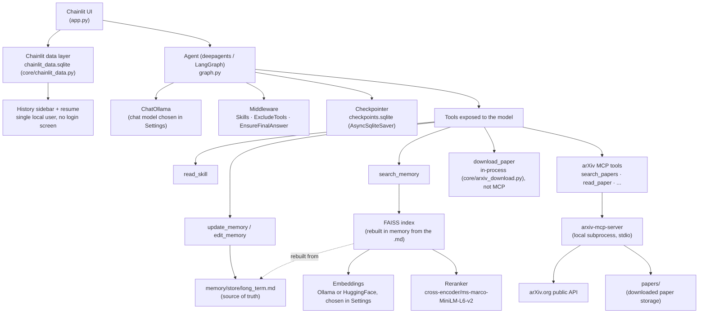

# Research Agent

A 100% local AI research agent. It runs on [Ollama](https://ollama.com) and/or HuggingFace models you already have installed locally — the same models you might already be using for other local AI projects — with no calls to external APIs and no paid API keys required.

This project is under active development — this README reflects what is implemented and tested today, not a final vision.

## Table of contents

- [Goal](#goal)
- [Vision](#vision)
- [Current status](#current-status)
- [Architecture](#architecture)
- [Tools](#tools)
- [Tech stack](#tech-stack)
- [Prerequisites](#prerequisites)
- [Installation](#installation)
- [Chat configuration](#chat-configuration)
- [Project structure](#project-structure)
- [How memory works](#how-memory-works)
- [arXiv integration](#arxiv-integration)
- [Known limitations](#known-limitations)
- [Roadmap](#roadmap)

## Goal

Build a personal research assistant that can search, retrieve, and reason over academic papers (starting with arXiv), while remembering the context of an ongoing research thread across sessions — all running entirely on the user's own machine, on models they choose and already have installed, with no research data ever leaving the device.

Beyond the assistant itself, this project exists to actually learn — hands-on, not just in theory — how to:

- Manage "public" MCP servers locally, and work around the fact that they tend to be buggier and less polished than closed, API-key-gated ones.
- Manage memory in a local setup, both short-term (conversation state) and long-term (persistent, structured, searchable).
- Learn how to manage and build memory graphs in local environments.
- Build RAG pipelines over different kinds of underlying structure, not just one fixed content shape.
- Learn the real limitations of small local models firsthand — worse tool use, worse answers, infinite loops around tool calls, etc. — instead of assuming a bigger model would just make the problem disappear.
- Manage model traceability/observability — local in this project specifically, but the approach should generalize beyond local setups.
- Build a multimodal document-analysis pipeline.
- Manage a repository structure for correctly storing external documents (papers, in this case) through their proper stages — raw, processed, etc. — instead of collapsing everything into one flat blob.
- Build a set of skills for hands-on paper analysis — keyword finding, paper summarization, etc. — with the ability to personalize the strategies used, since different users may want to focus on different things from a paper.

## Vision

A personal research agent that:

- Searches and downloads papers from arXiv on demand.
- Maintains a local repository of papers already found/analyzed.
- Answers questions by citing concrete fragments from those papers (RAG over the actual content, not just metadata).
- Remembers the active research topic, user preferences, and relevant papers already seen, across sessions.
- Runs entirely locally — no dependency on paid APIs, no data sent to third parties.

## Current status

| Piece | Status |
|---|---|
| Local chat with Ollama (chainlit + langchain/langgraph) | ✅ Implemented |
| Agent via `deepagents` (`create_deep_agent`), with fine-grained control over which tools the model sees | ✅ Implemented |
| Skills system (progressive disclosure) | ✅ Implemented (system only — no skill loaded yet, see Roadmap) |
| Persistent conversation memory (SQLite checkpointer) | ✅ Implemented |
| Chat history sidebar + resuming past conversations | ✅ Implemented (Chainlit data layer, SQLite; single local user, no login screen) |
| Automatic conversation summarization to avoid saturating the context | ✅ Implemented |
| Editable long-term memory (preferences, active topic, papers) | ✅ Implemented |
| RAG over long-term memory (FAISS + reranker) | ✅ Implemented |
| Local model catalog (Ollama + HuggingFace cache) | ✅ Implemented |
| Error handling with short user-facing messages | ✅ Implemented |
| Per-turn metrics logging (tokens, timings, tools used) | ✅ Implemented |
| Observability dashboard (compare metrics across runs/models) | ⏳ Pending — metrics are already logged, there's just no interface to view/compare them yet |
| Agent build caching (no full rebuild on every message) | ✅ Implemented |
| arXiv paper search and reading (via MCP) | ✅ Implemented |
| arXiv paper download | ✅ Implemented — in-process (`core/arxiv_download.py`), not via MCP; see [Tools](#tools) |
| Local repository of downloaded papers | ✅ Implemented (`papers/`, written by `download_paper`) |
| RAG over paper content | ⏳ Pending — dropped the MCP server's own `semantic_search` (abstract-only, no author/category/date filtering, redundant with `search_memory`); full-text RAG over papers not yet built |
| Memory graph (relationships between papers/topics) | ⏳ Pending |
| Execution of HuggingFace models (beyond cataloging them) | ⏳ Pending (embeddings yes, text generation no) |

## Architecture



The model **never** has access to generic filesystem tools (`read_file`, `write_file`, `edit_file`, `ls`, `glob`, `grep`, `execute`) or subagents (`task`) — these are explicitly hidden via `ExcludeToolsMiddleware`. Everything the model can read or write goes through purpose-scoped tools (`read_skill`, `update_memory`, `edit_memory`, `search_memory`), each restricted to a single folder or file.

## Tools

| Tool | Purpose | Notes |
|---|---|---|
| `read_skill(skill_name, file_name="SKILL.md")` | Reads a skill's full instructions, or a supporting file it references. | Scoped to `skills/<skill_name>/` — cannot read anything outside it. |
| `update_memory(content, category)` | Adds a new long-term memory entry. | `category` is one of `preference`, `research_topic`, `keyword`, `paper`, `note`. Only ever touches `memory/store/long_term.md`. |
| `edit_memory(entry_id, content=None, category=None, delete=False)` | Replaces, corrects, or deletes an existing memory entry. | Affects exactly one entry, located by id — never rewrites the rest of the file. |
| `search_memory(query, k=5)` | Semantic search over long-term memory. | Retrieves up to 15 candidates via FAISS, reranks them with a cross-encoder, returns the top `k`. |
| `search_papers(query, max_results, date_from, date_to, categories, sort_by)` | Searches arXiv by keywords/filters. | arXiv MCP tool. Rate-limited to arXiv's own policy. |
| `get_abstract(paper_id)` | Fetches a paper's abstract and metadata without downloading it. | arXiv MCP tool. |
| `download_paper(paper_id, start, max_chars)` | Downloads a paper's full text (LaTeX source preferred for real section structure, then HTML, then PDF conversion as last resort) into `papers/`. | Runs in-process (`core/arxiv_download.py`), not through the MCP server — the MCP round-trip for this specific tool was found to hang unpredictably (minutes, or indefinitely) even when the same fetch/convert logic run directly completes in under a minute. |
| `read_paper(paper_id, start, max_chars)` | Reads a paper previously saved with `download_paper`. | arXiv MCP tool. |
| `list_papers()` | Lists all papers downloaded so far. | arXiv MCP tool. |
| `citation_graph(paper_id)` | Papers that cite, and are cited by, a given paper. | arXiv MCP tool, via Semantic Scholar. |
| `watch_topic(topic, categories, max_results)` | Saves a persistent arXiv search to monitor for new papers. | arXiv MCP tool. |
| `check_alerts(topic)` | Checks saved topic watches for newly published papers. | arXiv MCP tool. |

**Explicitly hidden from the model**: `ls`, `read_file`, `write_file`, `edit_file`, `glob`, `grep`, `execute`, `task` — the generic filesystem and subagent-launching tools `deepagents` registers by default (see [Architecture](#architecture)).

## Tech stack

- **UI / chat server**: [Chainlit](https://chainlit.io)
- **Agent orchestration**: [LangGraph](https://langchain-ai.github.io/langgraph/) + [`deepagents`](https://github.com/langchain-ai/deepagents) (skills, memory, auto-summarization, and filesystem middleware)
- **Local LLM**: [Ollama](https://ollama.com) via `langchain-ollama`. HuggingFace local models were evaluated as a second chat-model option but aren't supported yet — see [Known limitations](#known-limitations).
- **Embeddings**: `OllamaEmbeddings` or `HuggingFaceEmbeddings` (`langchain-huggingface` + `sentence-transformers`), configurable per session
- **Vector store**: [FAISS](https://github.com/facebookresearch/faiss) (`faiss-cpu`, local, no server)
- **Reranker**: `cross-encoder/ms-marco-MiniLM-L6-v2` via `langchain_community.cross_encoders.HuggingFaceCrossEncoder`
- **Conversation persistence**: SQLite (`langgraph-checkpoint-sqlite` + `aiosqlite`)
- **Model catalog**: the `ollama` python client (capabilities, context length) + `huggingface_hub` (local HF cache)
- **arXiv integration**: [`arxiv-mcp-server`](https://github.com/blazickjp/arxiv-mcp-server) (local MCP server, installed via `uv`) + `langchain-mcp-adapters` to expose its tools to the agent
- **Observability**: per-turn metrics logged to SQLite (`observability/metrics_store.py`) — no viewer/dashboard yet, see [Roadmap](#roadmap)

## Prerequisites

- Python 3.11+ (tested on 3.13)
- [Ollama](https://ollama.com) installed and running (`ollama serve`)
- At least one chat model with tool-calling support downloaded, e.g.:
  ```bash
  ollama pull llama3.2
  ```
- At least one embedding model downloaded to be able to use `search_memory`, e.g.:
  ```bash
  ollama pull mxbai-embed-large
  ```
- [`uv`](https://docs.astral.sh/uv/) installed — the arXiv MCP server (with its `pdf` extra, needed to read papers) is pulled automatically on first use via `uv tool run`, no manual install step required.
- Disk space for automatic downloads on first use: the reranker (~90MB) and, if a HuggingFace embedding model is chosen, `sentence-transformers`/`torch` must already be installed (see below) plus the model itself.

### Tested with

Any Ollama model with tool-calling support should work, but this project has actually been run end-to-end with:

- **Main chat model**: `qwen3.5` — used for the bulk of testing, including the paper-download and memory-persistence verification described in this README.
- **Embedding model**: `mxbai-embed-large`
- **Small local model**: `llama3.2:1b` / `llama3.2:3b` — used to stress-test the robustness middleware (`EnsureFinalAnswerMiddleware`, tool-argument tolerance, `PaperMemoryMiddleware`) against a model much more prone to empty responses and malformed tool calls than the main one. `llama3.2:3b` specifically is also hardcoded as the second-tier fallback model inside `EnsureFinalAnswerMiddleware` itself (see below) — not just something used to test with.

## Installation

```bash
python -m venv .venv
.venv\Scripts\activate      # Windows
pip install -r requirements.txt
chainlit create-secret       # one-time: paste the printed CHAINLIT_AUTH_SECRET into a .env file
ollama serve                # if not already running
chainlit run app.py
```

`CHAINLIT_AUTH_SECRET` is required by Chainlit to enable the thread history sidebar (see `core/chainlit_data.py`) — without it, `chainlit run` fails at startup. It's a local-only secret; nothing about it is sent anywhere.

## Chat configuration

Settings available in the Chainlit sidebar:

| Setting | What it does |
|---|---|
| **Model** | Ollama chat model. Only models with the `completion` capability are listed (embedding models, like `mxbai-embed-large`, don't show up here). |
| **Embedding Model** | Model used by `search_memory`. Includes Ollama embedding models (`embedding` capability) and HuggingFace ones (detected by the presence of `modules.json` in the local cache — sentence-transformers compatibility), listed together by name — which backend actually serves a given model is resolved internally and not shown in the dropdown. |
| **Temperature** | Generation temperature for the chat model. |
| **Memory** | When on, the agent remembers earlier messages from this conversation (via the checkpointer) — and reusing Chainlit's own thread id means resuming this conversation later from the history sidebar continues the exact same agent state, not just the transcript. When off, every message starts with no prior context. |
| **Streaming** | Streams the response token by token instead of waiting for the full answer. |

Ollama loads a model into memory the first time it's used in a while, which can take a minute or more with no visible progress otherwise — easy to mistake for the app being frozen. A "⏳ Loading the model…" message is shown for exactly that window, and disappears the moment real output starts (first tool call or first streamed token).

Since this app has a single local user, a brand new session (new tab, page refresh, or a reconnect after a long silent wait) almost always means the previous one was abandoned rather than a deliberate second conversation — so starting a new chat automatically cancels whatever message was still being processed in the old one, instead of leaving it to keep running unseen and competing for the same Ollama request.

## Project structure

```
.
├── app.py                     # Chainlit entrypoint: UI, settings, error handling
├── graph.py                   # Agent construction (deepagents/LangGraph), checkpointer
├── core/
│   ├── tools.py                # General-purpose tools: read_skill
│   ├── arxiv_download.py        # download_paper — in-process (not MCP), see Tools below
│   ├── middleware.py            # ExcludeToolsMiddleware, EnsureFinalAnswerMiddleware, PaperMemoryMiddleware, ArxivTimeoutMiddleware (custom)
│   ├── chainlit_data.py          # SQLite-backed Chainlit data layer (history sidebar/resume) + local-only auth
│   ├── ollama_functions.py      # Ollama model catalog (capabilities, context length) + LLM metrics
│   └── huggingface_functions.py # Local HuggingFace cache catalog
├── prompts/
│   ├── research_agent_prompt.py     # SYSTEM_PROMPT — base agent identity/behavior
│   ├── skills_prompt.py             # Skills system prompt (SkillsMiddleware)
│   ├── memory_prompt.py             # Long-term memory prompt template
│   ├── arxiv_prompt.py              # arXiv tools prompt (includes the untrusted-content warning)
│   └── ensure_final_answer_prompt.py # NUDGE_MESSAGE / FALLBACK_MESSAGE / FALLBACK_MODEL_UNAVAILABLE_MESSAGE (EnsureFinalAnswerMiddleware)
├── memory/
│   ├── memory_tools.py        # update_memory / edit_memory — long-term memory
│   ├── memory_rag.py          # search_memory — FAISS + embeddings + reranker
│   └── store/                 # Generated data: long_term.md (do not version-control)
├── skills/                    # User-added skills go here (progressive disclosure via read_skill)
├── observability/
│   ├── metrics_store.py       # log_turn — per-turn metrics (tokens, timings, tools used)
│   └── metrics.sqlite         # Generated data (do not version-control)
├── papers/                    # Downloaded papers (managed by arxiv-mcp-server, do not version-control)
├── checkpoints.sqlite         # Persisted conversation state (do not version-control)
├── chainlit_data.sqlite       # Thread history for the sidebar (do not version-control)
├── .env                       # CHAINLIT_AUTH_SECRET (do not version-control, never commit)
└── requirements.txt
```

## How memory works

There are two independent memory systems, solving different problems:

**Conversation memory (short-term)** — a LangGraph checkpointer (`AsyncSqliteSaver`) persists the full graph state (messages, tool calls, results) indexed by `thread_id`. A `SummarizationMiddleware` automatically summarizes older history as it approaches the chosen model's real `num_ctx`, to avoid overflowing the context window.

**Long-term memory (across sessions)** — lives in `memory/store/long_term.md`. Each entry has a stable id, a category (`preference`, `research_topic`, `keyword`, `paper`, `note`), and a timestamp, delimited by HTML markers the model never sees (they're stripped before being injected into the prompt) but that let the tools locate and edit an exact entry. The model only sees a lightweight index (id + category + timestamp) in the system prompt — to read the full content it calls `search_memory`, which:

1. Retrieves up to 15 candidates from a FAISS index by embedding similarity.
2. Reorders them with a cross-encoder reranker (more precise than similarity alone).
3. Returns the top `k` (5 by default).

The FAISS index is a derived cache that gets rebuilt in memory whenever `long_term.md` changes — it's never persisted to disk, so it can never drift out of sync with the source of truth.

## arXiv integration

arXiv access is provided by [`arxiv-mcp-server`](https://github.com/blazickjp/arxiv-mcp-server), a local [MCP](https://modelcontextprotocol.io) server launched as a subprocess (`uv tool run arxiv-mcp-server`, stdio transport) and connected via `langchain-mcp-adapters`. No API key — arXiv's API is free and public.

Tools exposed to the model: `search_papers`, `get_abstract`, `download_paper` (in-process, not MCP — see [Tools](#tools)), `read_paper`, `list_papers`, `citation_graph` (via Semantic Scholar), `watch_topic`/`check_alerts` (persistent topic monitoring). Downloaded papers are stored in `papers/` at the project root. The MCP server's own `semantic_search`/`reindex` are deliberately excluded — see [Known limitations](#known-limitations).

**Security**: the text of a paper is external content the agent did not choose and cannot vet — a paper could contain adversarial text designed to look like an instruction. The MCP server itself already tags results as `[EXTERNAL CONTENT]`, and the agent's system prompt explicitly tells it to treat paper text as data to report on, never as commands to follow. This is the same instruction-source boundary applied to any other untrusted input.

The MCP tool set is fetched once (lazily, on first use) and reused for the lifetime of the process — connecting is not repeated on every message.

## Known limitations

- **Small local models are unreliable with complex tool-call sequences** — models like `llama3.2:latest` (3B) have been observed to sometimes pass malformed arguments (e.g. a string where the MCP tool schema strictly requires an integer), or hallucinate tool calls. `EnsureFinalAnswerMiddleware` guarantees a turn never ends blank — first by re-asking the selected model itself (up to 2 tries), then, if it still won't answer, by retrying against a small hardcoded fallback model (`llama3.2:3b`, up to 2 tries), and only then falling back to a fixed message — but none of that fixes the model's own reasoning mistakes mid-turn (a malformed tool call still fails as a malformed tool call). Larger local models (e.g. `cogito:8b`) have been noticeably more reliable in testing, including with the arXiv MCP tools.
- **Retrieval quality depends heavily on the embedding model and corpus size** — with few entries in memory, raw similarity can rank poorly (which is why the reranker was added). With very small corpora the reranker helps but isn't foolproof.
- **Long-term memory can only grow** — `update_memory`/`edit_memory` don't auto-consolidate or summarize old entries; there is currently no process that prunes them automatically.
- **HuggingFace model execution is limited to embeddings** — the catalog detects any cached model, but execution is only implemented for sentence-transformers-compatible embedding models. HF chat/generation models aren't selectable, and this isn't just an unimplemented nicety: `langchain-huggingface`'s `ChatHuggingFace` wrapper was evaluated and its local, offline backend (`HuggingFacePipeline`) doesn't support multi-turn tool-calling at all — verified by reading its source (`_to_chatml_format` raises on a `ToolMessage`, and `_to_chat_prompt` never passes `tools=` into the chat template). Since this agent's whole design depends on tool calls (arXiv, memory, etc.), that's a hard blocker for the library's out-of-the-box local backend, not something a quick fix resolves. A custom tool-calling adapter on top of raw `transformers` was considered and deliberately not built — out of scope for now.
- **No code execution sandboxing** — the `execute` tool isn't enabled, so this doesn't apply today, but if it's re-enabled in the future there is no process isolation.
- **The MCP server's own `semantic_search`/`reindex` were deliberately dropped**, not just left unused — they only embed each paper's short abstract (never the full downloaded text), don't support author/category/date filtering, and duplicate what `search_memory` already covers over the same abstracts (via `PaperMemoryMiddleware`), without a reranker. Full-text RAG over papers (chunked, over actual paper content) isn't built yet (see Roadmap).

## Roadmap

1. ~~arXiv integration (paper search and download)~~ — done; search/reading via MCP, download in-process (`core/arxiv_download.py`).
2. ~~Local repository of downloaded papers~~ — done, written by `download_paper` to `papers/`.
3. Full-text RAG over paper content — chunk the actual downloaded papers (not just abstracts) into our own FAISS/`memory_rag.py` pipeline, with reranking, instead of the abstract-only search the MCP server's `semantic_search` offered (now removed).
4. Memory graph — relationships between papers, topics, and concepts, not just a flat list of entries. `citation_graph` (via Semantic Scholar) is a natural building block.
5. Observability dashboard — an interface, possibly external, to visualize and compare the per-turn metrics already being logged (`observability/metrics_store.py`: tokens, latency, tools used) across models/configs. Only the logging exists today; nothing renders it yet.
6. Skills for working with papers — the skills system (`SkillsMiddleware`, `read_skill`) is wired in but has no skill loaded yet; the plan is to add skills around actual paper workflows (e.g. literature-review structure, note-taking conventions for findings, citation formatting) rather than a generic placeholder example.
