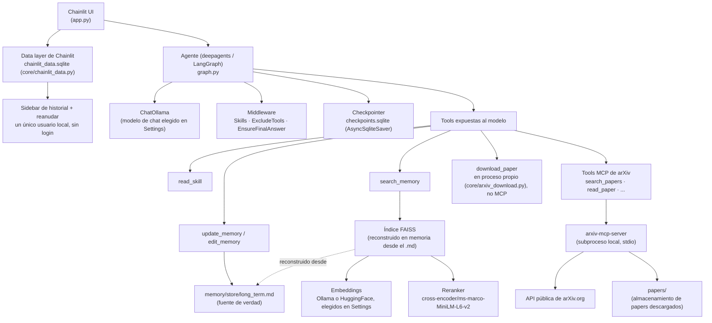

# Research Agent

Un agente de investigación de IA 100% local. Corre sobre modelos de [Ollama](https://ollama.com) y/o de HuggingFace que ya tengas instalados en local — los mismos modelos que quizás ya uses para otros proyectos de IA local — sin llamadas a APIs externas ni claves de pago.

Este proyecto está en desarrollo activo — este documento refleja lo que hay implementado y probado hoy, no una visión final.

## Tabla de contenidos

- [Objetivo](#objetivo)
- [Visión](#visión)
- [Estado actual](#estado-actual)
- [Arquitectura](#arquitectura)
- [Tools](#tools)
- [Stack técnico](#stack-técnico)
- [Requisitos previos](#requisitos-previos)
- [Instalación](#instalación)
- [Configuración del chat](#configuración-del-chat)
- [Estructura del proyecto](#estructura-del-proyecto)
- [Cómo funciona la memoria](#cómo-funciona-la-memoria)
- [Integración con arXiv](#integración-con-arxiv)
- [Limitaciones conocidas](#limitaciones-conocidas)
- [Roadmap](#roadmap)

## Objetivo

Construir un asistente de investigación personal capaz de buscar, recuperar y razonar sobre papers académicos (empezando por arXiv), recordando el contexto de una línea de investigación activa entre sesiones — todo corriendo por completo en la máquina del usuario, sobre los modelos que elija y ya tenga instalados, sin que ningún dato de investigación salga nunca del dispositivo.

Más allá del propio asistente, este proyecto existe para aprender de verdad — de forma práctica, no solo en teoría — a:

- Gestionar MCPs "públicos" en local, y lidiar con que suelen tener más bugs y estar menos pulidos que los cerrados, protegidos por API key.
- Gestionar memoria en un entorno local, tanto a corto plazo (estado de la conversación) como a largo plazo (persistente, estructurada, buscable).
- Aprender a gestionar y crear memory graphs en entornos locales.
- Construir pipelines de RAG sobre distintos tipos de estructura subyacente, no solo sobre un único formato de contenido fijo.
- Aprender de primera mano las limitaciones reales de los modelos pequeños en local — peor uso de herramientas, peores respuestas, bucles infinitos con las tools, etc. — en vez de asumir que un modelo más grande simplemente haría desaparecer el problema.
- Gestionar la trazabilidad/observabilidad de modelos — en este proyecto en concreto en local, pero el planteamiento debería ser extrapolable más allá de entornos locales.
- Construir un pipeline de análisis multimodal de documentos.
- Gestionar una estructura de repositorio para almacenar correctamente documentos externos (los papers, en este caso) a través de sus etapas debidas — raw, procesado, etc. — en vez de meterlo todo en un único bloque plano.
- Construir un conjunto de skills para el análisis práctico de papers — encontrar palabras clave, resumir papers, etc. — con la posibilidad de personalizar las estrategias usadas, ya que distintos usuarios pueden querer centrarse en cosas distintas de un paper.

## Visión

Un agente de investigación personal que:

- Busca y descarga papers de arXiv bajo demanda.
- Mantiene un repositorio local de los papers ya encontrados/analizados.
- Responde preguntas citando fragmentos concretos de esos papers (RAG sobre el contenido real, no solo sobre metadatos).
- Recuerda entre sesiones el tema de investigación activo, las preferencias del usuario y los papers relevantes ya vistos.
- Corre enteramente en local — sin depender de APIs de pago, sin enviar datos a terceros.

## Estado actual

| Pieza | Estado |
|---|---|
| Chat local con Ollama (chainlit + langchain/langgraph) | ✅ Implementado |
| Agente vía `deepagents` (`create_deep_agent`), con control fino de qué tools ve el modelo | ✅ Implementado |
| Sistema de skills (progressive disclosure) | ✅ Implementado (solo el sistema — todavía sin ninguna skill cargada, ver Roadmap) |
| Memoria de conversación persistente (checkpointer SQLite) | ✅ Implementado |
| Sidebar de historial de chats + reanudar conversaciones anteriores | ✅ Implementado (data layer de Chainlit, SQLite; un único usuario local, sin pantalla de login) |
| Auto-resumen de conversación para no saturar el contexto | ✅ Implementado |
| Memoria a largo plazo editable (preferencias, tema activo, papers) | ✅ Implementado |
| RAG sobre la memoria a largo plazo (FAISS + reranker) | ✅ Implementado |
| Catálogo de modelos locales (Ollama + caché de HuggingFace) | ✅ Implementado |
| Manejo de errores con mensajes cortos al usuario | ✅ Implementado |
| Registro de métricas por turno (tokens, tiempos, tools usadas) | ✅ Implementado |
| Panel de observabilidad (comparar métricas entre ejecuciones/modelos) | ⏳ Pendiente — las métricas ya se registran, solo falta una interfaz para verlas/compararlas |
| Cache de construcción del agente (no se reconstruye entero en cada mensaje) | ✅ Implementado |
| Búsqueda y lectura de papers de arXiv (vía MCP) | ✅ Implementado |
| Descarga de papers de arXiv | ✅ Implementado — en proceso propio (`core/arxiv_download.py`), no vía MCP; ver [Tools](#tools) |
| Repositorio local de papers descargados | ✅ Implementado (`papers/`, escrito por `download_paper`) |
| RAG sobre el contenido de los papers | ⏳ Pendiente — se quitó el `semantic_search` propio del servidor MCP (solo abstract, sin filtro por autor/categoría/fecha, redundante con `search_memory`); RAG real sobre el texto completo todavía no está construido |
| Grafo de memoria (relaciones entre papers/temas) | ⏳ Pendiente |
| Ejecución de modelos de HuggingFace (más allá de catalogarlos) | ⏳ Pendiente (embeddings sí, generación de texto no) |

## Arquitectura



El modelo **nunca** tiene acceso a herramientas genéricas de filesystem (`read_file`, `write_file`, `edit_file`, `ls`, `glob`, `grep`, `execute`) ni a subagentes (`task`) — se ocultan explícitamente vía `ExcludeToolsMiddleware`. Todo lo que el modelo puede leer o escribir pasa por tools acotadas a propósito (`read_skill`, `update_memory`, `edit_memory`, `search_memory`), cada una limitada a una carpeta o archivo concreto.

## Tools

| Tool | Para qué sirve | Notas |
|---|---|---|
| `read_skill(skill_name, file_name="SKILL.md")` | Lee las instrucciones completas de una skill, o un archivo de apoyo que referencie. | Acotada a `skills/<skill_name>/` — no puede leer nada fuera de ahí. |
| `update_memory(content, category)` | Añade una entrada nueva a la memoria a largo plazo. | `category` es una de `preference`, `research_topic`, `keyword`, `paper`, `note`. Solo toca `memory/store/long_term.md`. |
| `edit_memory(entry_id, content=None, category=None, delete=False)` | Reemplaza, corrige o borra una entrada existente de memoria. | Afecta a exactamente una entrada, localizada por id — nunca reescribe el resto del archivo. |
| `search_memory(query, k=5)` | Búsqueda semántica sobre la memoria a largo plazo. | Recupera hasta 15 candidatos vía FAISS, los reordena con un cross-encoder, devuelve los `k` mejores. |
| `search_papers(query, max_results, date_from, date_to, categories, sort_by)` | Busca en arXiv por palabras clave/filtros. | Tool MCP de arXiv. Limitada a 3 segundos entre llamadas por política de arXiv. |
| `get_abstract(paper_id)` | Trae el abstract y metadatos de un paper sin descargarlo. | Tool MCP de arXiv. |
| `download_paper(paper_id, start, max_chars)` | Descarga el texto completo de un paper (fuente LaTeX preferida por su estructura real de secciones, luego HTML, y PDF como último recurso) a `papers/`. | Corre en nuestro propio proceso (`core/arxiv_download.py`), no a través del servidor MCP — se comprobó que el viaje de ida y vuelta por MCP para esta tool en concreto podía tardar minutos, o colgarse indefinidamente, incluso cuando la misma lógica de descarga/conversión ejecutada directamente termina en menos de un minuto. |
| `read_paper(paper_id, start, max_chars)` | Lee un paper previamente guardado con `download_paper`. | Tool MCP de arXiv. |
| `list_papers()` | Lista todos los papers descargados hasta ahora. | Tool MCP de arXiv. |
| `citation_graph(paper_id)` | Papers que citan a uno dado, y a los que ese paper cita. | Tool MCP de arXiv, vía Semantic Scholar. |
| `watch_topic(topic, categories, max_results)` | Guarda una búsqueda de arXiv persistente para vigilar papers nuevos. | Tool MCP de arXiv. |
| `check_alerts(topic)` | Comprueba las búsquedas guardadas en busca de papers publicados recientemente. | Tool MCP de arXiv. |

**Explícitamente ocultas al modelo**: `ls`, `read_file`, `write_file`, `edit_file`, `glob`, `grep`, `execute`, `task` — las tools genéricas de filesystem y de lanzamiento de subagentes que `deepagents` registra por defecto (ver [Arquitectura](#arquitectura)).

## Stack técnico

- **UI / servidor de chat**: [Chainlit](https://chainlit.io)
- **Orquestación del agente**: [LangGraph](https://langchain-ai.github.io/langgraph/) + [`deepagents`](https://github.com/langchain-ai/deepagents) (middleware de skills, memoria, resumen automático y filesystem)
- **LLM local**: [Ollama](https://ollama.com) vía `langchain-ollama`. Se evaluaron modelos locales de HuggingFace como segunda opción de modelo de chat, pero no están soportados todavía — ver [Limitaciones conocidas](#limitaciones-conocidas).
- **Embeddings**: `OllamaEmbeddings` o `HuggingFaceEmbeddings` (`langchain-huggingface` + `sentence-transformers`), configurable por sesión
- **Vector store**: [FAISS](https://github.com/facebookresearch/faiss) (`faiss-cpu`, local, sin servidor)
- **Reranker**: `cross-encoder/ms-marco-MiniLM-L6-v2` vía `langchain_community.cross_encoders.HuggingFaceCrossEncoder`
- **Persistencia de conversación**: SQLite (`langgraph-checkpoint-sqlite` + `aiosqlite`)
- **Catálogo de modelos**: cliente python `ollama` (capabilities, context length) + `huggingface_hub` (caché local de HF)
- **Integración con arXiv**: [`arxiv-mcp-server`](https://github.com/blazickjp/arxiv-mcp-server) (servidor MCP local, instalado vía `uv`) + `langchain-mcp-adapters` para exponer sus tools al agente
- **Observabilidad**: métricas por turno registradas en SQLite (`observability/metrics_store.py`) — sin panel/interfaz todavía, ver [Roadmap](#roadmap)

## Requisitos previos

- Python 3.11+ (probado en 3.13)
- [Ollama](https://ollama.com) instalado y corriendo (`ollama serve`)
- Al menos un modelo de chat con soporte de tool calling descargado, ej.:
  ```bash
  ollama pull llama3.2
  ```
- Al menos un modelo de embeddings descargado para poder usar `search_memory`, ej.:
  ```bash
  ollama pull mxbai-embed-large
  ```
- [`uv`](https://docs.astral.sh/uv/) instalado — el servidor MCP de arXiv (con su extra `pdf`, necesario para leer papers) se descarga automáticamente la primera vez que se usa vía `uv tool run`, sin ningún paso de instalación manual.
- Espacio en disco para las descargas automáticas la primera vez que se usan: el reranker (~90MB) y, si se elige un modelo de embeddings de HuggingFace, `sentence-transformers`/`torch` ya deben estar instalados (ver más abajo) más el propio modelo.

### Probado con

Cualquier modelo de Ollama con soporte de tool-calling debería funcionar, pero este proyecto se ha probado de extremo a extremo con:

- **Modelo de chat principal**: `qwen3.5` — usado para la mayoría de las pruebas, incluida la verificación de descarga de papers y persistencia de memoria descrita en este README.
- **Modelo de embeddings**: `mxbai-embed-large`
- **Modelo local pequeño**: `llama3.2:1b` / `llama3.2:3b` — usado para poner a prueba el middleware de robustez (`EnsureFinalAnswerMiddleware`, tolerancia en los argumentos de las tools, `PaperMemoryMiddleware`) frente a un modelo mucho más propenso a respuestas vacías y llamadas a herramientas mal formadas que el principal. `llama3.2:3b` en concreto también está hardcodeado como modelo de fallback de segundo nivel dentro del propio `EnsureFinalAnswerMiddleware` (ver más abajo) — no es solo un modelo usado para probar.

## Instalación

```bash
python -m venv .venv
.venv\Scripts\activate      # Windows
pip install -r requirements.txt
chainlit create-secret       # una vez: pega el CHAINLIT_AUTH_SECRET impreso en un archivo .env
ollama serve                # si no está ya corriendo
chainlit run app.py
```

`CHAINLIT_AUTH_SECRET` es requerido por Chainlit para habilitar el sidebar de historial de chats (ver `core/chainlit_data.py`) — sin él, `chainlit run` falla al arrancar. Es un secreto puramente local; no se envía a ningún sitio.

## Configuración del chat

Ajustes disponibles en la barra lateral de Chainlit:

| Ajuste | Qué hace |
|---|---|
| **Model** | Modelo de chat de Ollama. Solo se listan modelos con capability `completion` (los de embeddings, como `mxbai-embed-large`, no aparecen aquí). |
| **Embedding Model** | Modelo usado por `search_memory`. Incluye modelos de embeddings de Ollama (capability `embedding`) y de HuggingFace (detectados por la presencia de `modules.json` en la caché local — compatibilidad con sentence-transformers), listados juntos por nombre — de qué backend viene cada modelo se resuelve internamente y no se muestra en el desplegable. |
| **Temperature** | Temperatura de generación del modelo de chat. |
| **Memory** | Si está activado, el agente recuerda los mensajes anteriores de esta conversación (vía checkpointer) — y al reutilizar el propio thread id de Chainlit, reanudar esta conversación más tarde desde el sidebar de historial continúa el mismo estado del agente, no solo la transcripción. Si está desactivado, cada mensaje arranca sin contexto previo. |
| **Streaming** | Muestra la respuesta token a token en vez de esperar al final. |

Ollama carga un modelo en memoria la primera vez que se usa en un rato, lo cual puede tardar un minuto o más sin ningún progreso visible — fácil de confundir con que la app se ha quedado colgada. Se muestra un mensaje "⏳ Loading the model…" exactamente durante esa espera, y desaparece en cuanto llega contenido real (la primera tool call o el primer token de streaming).

Como esta app tiene un único usuario local, una sesión nueva (pestaña nueva, recarga de página, o una reconexión tras una espera larga y silenciosa) casi siempre significa que la anterior quedó abandonada, no una segunda conversación deliberada — así que iniciar un chat nuevo cancela automáticamente cualquier mensaje que se siguiera procesando en el anterior, en vez de dejarlo corriendo sin que nadie lo vea, compitiendo por el mismo request a Ollama.

## Estructura del proyecto

```
.
├── app.py                     # Entrypoint de Chainlit: UI, settings, manejo de errores
├── graph.py                   # Construcción del agente (deepagents/LangGraph), checkpointer
├── core/
│   ├── tools.py                # Tools de propósito general: read_skill
│   ├── arxiv_download.py        # download_paper — en proceso propio (no MCP), ver Tools más abajo
│   ├── middleware.py            # ExcludeToolsMiddleware, EnsureFinalAnswerMiddleware, PaperMemoryMiddleware, ArxivTimeoutMiddleware (propios)
│   ├── chainlit_data.py          # Data layer de Chainlit sobre SQLite (sidebar/reanudar) + auth solo local
│   ├── ollama_functions.py      # Catálogo de modelos Ollama (capabilities, context length) + métricas LLM
│   └── huggingface_functions.py # Catálogo de la caché local de HuggingFace
├── prompts/
│   ├── research_agent_prompt.py     # SYSTEM_PROMPT — identidad/comportamiento base del agente
│   ├── skills_prompt.py             # Prompt del sistema de skills (SkillsMiddleware)
│   ├── memory_prompt.py             # Plantilla de prompt de la memoria a largo plazo
│   ├── arxiv_prompt.py              # Prompt de las tools de arXiv (incluye el aviso de contenido no confiable)
│   └── ensure_final_answer_prompt.py # NUDGE_MESSAGE / FALLBACK_MESSAGE / FALLBACK_MODEL_UNAVAILABLE_MESSAGE (EnsureFinalAnswerMiddleware)
├── memory/
│   ├── memory_tools.py        # update_memory / edit_memory — memoria a largo plazo
│   ├── memory_rag.py          # search_memory — FAISS + embeddings + reranker
│   └── store/                 # Datos generados: long_term.md (no versionar)
├── skills/                    # Skills que añada el usuario (progressive disclosure vía read_skill)
├── observability/
│   ├── metrics_store.py       # log_turn — métricas por turno (tokens, tiempos, tools usadas)
│   └── metrics.sqlite         # Datos generados (no versionar)
├── papers/                    # Papers descargados (gestionado por arxiv-mcp-server, no versionar)
├── checkpoints.sqlite         # Estado de conversación persistido (no versionar)
├── chainlit_data.sqlite       # Historial de chats para el sidebar (no versionar)
├── .env                       # CHAINLIT_AUTH_SECRET (no versionar, nunca commitear)
└── requirements.txt
```

## Cómo funciona la memoria

Hay dos sistemas de memoria independientes, que resuelven problemas distintos:

**Memoria de conversación (corto plazo)** — un checkpointer de LangGraph (`AsyncSqliteSaver`) persiste el estado completo del grafo (mensajes, tool calls, resultados) indexado por `thread_id`. Un `SummarizationMiddleware` resume automáticamente el historial antiguo cuando se acerca al `num_ctx` real del modelo elegido, para no desbordar el contexto.

**Memoria a largo plazo (entre sesiones)** — vive en `memory/store/long_term.md`. Cada entrada tiene un id estable, una categoría (`preference`, `research_topic`, `keyword`, `paper`, `note`) y un timestamp, delimitada por marcadores HTML que el modelo no ve (se eliminan antes de inyectarse en el prompt) pero que permiten a las tools localizar y editar una entrada exacta. El modelo solo ve un índice ligero (id + categoría + timestamp) en el system prompt — para leer el contenido completo llama a `search_memory`, que:

1. Recupera hasta 15 candidatos de un índice FAISS por similitud de embeddings.
2. Los reordena con un cross-encoder reranker (más preciso que la similitud sola).
3. Devuelve los `k` mejores (por defecto 5).

El índice FAISS es un caché derivado que se reconstruye en memoria cuando cambia `long_term.md` — nunca se persiste a disco, así que no hay riesgo de que se desincronice de la fuente de verdad.

## Integración con arXiv

El acceso a arXiv lo da [`arxiv-mcp-server`](https://github.com/blazickjp/arxiv-mcp-server), un servidor [MCP](https://modelcontextprotocol.io) local lanzado como subproceso (`uv tool run arxiv-mcp-server`, transporte stdio) y conectado vía `langchain-mcp-adapters`. Sin API key — la API de arXiv es pública y gratuita.

Tools expuestas al modelo: `search_papers`, `get_abstract`, `download_paper` (en proceso propio, no MCP — ver [Tools](#tools)), `read_paper`, `list_papers`, `citation_graph` (vía Semantic Scholar), `watch_topic`/`check_alerts` (monitorización persistente de temas). Los papers descargados se guardan en `papers/`, en la raíz del proyecto. El `semantic_search`/`reindex` propios del servidor MCP se excluyen deliberadamente — ver [Limitaciones conocidas](#limitaciones-conocidas).

**Seguridad**: el texto de un paper es contenido externo que el agente no ha elegido y no puede verificar — un paper podría contener texto adversario diseñado para parecer una instrucción. El propio servidor MCP ya marca los resultados como `[EXTERNAL CONTENT]`, y el system prompt del agente le dice explícitamente que trate el texto de los papers como datos sobre los que informar, nunca como órdenes a seguir. Es el mismo límite de "fuente de instrucciones" que se aplica a cualquier otro input no confiable.

El conjunto de tools MCP se obtiene una sola vez (de forma perezosa, en el primer uso) y se reutiliza durante toda la vida del proceso — no se vuelve a conectar en cada mensaje.

## Limitaciones conocidas

- **Modelos locales pequeños son poco fiables con secuencias de tool calls complejas** — se ha observado que modelos como `llama3.2:latest` (3B) a veces pasan argumentos con formato incorrecto (ej. un texto donde el schema de la tool MCP exige estrictamente un entero), o alucinan llamadas a herramientas. `EnsureFinalAnswerMiddleware` garantiza que el turno nunca termine en blanco — primero volviendo a pedir respuesta al propio modelo seleccionado (hasta 2 intentos), luego, si sigue sin responder, reintentando con un modelo de fallback pequeño y fijo (`llama3.2:3b`, hasta 2 intentos), y solo entonces cayendo a un mensaje fijo — pero nada de esto corrige errores de razonamiento del modelo a mitad de turno (una tool call mal formada sigue fallando igual). Modelos locales más grandes (ej. `cogito:8b`) han sido notablemente más fiables en las pruebas, incluso con las tools MCP de arXiv.
- **La calidad de retrieval depende mucho del modelo de embeddings y el tamaño del corpus** — con pocas entradas en memoria, la similitud pura puede rankear mal (por eso se añadió el reranker). Con corpus muy pequeños el reranker ayuda pero no es infalible.
- **La memoria a largo plazo solo puede crecer** — `update_memory`/`edit_memory` no auto-consolidan ni resumen entradas antiguas; a día de hoy no hay ningún proceso que las pode automáticamente.
- **Ejecución de modelos de HuggingFace limitada a embeddings** — el catálogo detecta cualquier modelo cacheado, pero solo hay ejecución implementada para modelos de embeddings compatibles con sentence-transformers. Los modelos de chat/generación de HF no son seleccionables, y esto no es solo algo pendiente de implementar: se evaluó el wrapper `ChatHuggingFace` de `langchain-huggingface` y su backend local sin servidor (`HuggingFacePipeline`) no soporta tool-calling multi-turno en absoluto — verificado leyendo su código fuente (`_to_chatml_format` falla con un `ToolMessage`, y `_to_chat_prompt` nunca pasa `tools=` al chat template). Como todo el diseño de este agente depende de las tool calls (arXiv, memoria, etc.), eso es un bloqueo real del backend local de la librería tal cual viene, no algo que se arregle con un parche rápido. Se consideró construir un adaptador propio de tool-calling sobre `transformers` directamente, y se descartó deliberadamente — fuera de alcance por ahora.
- **Sin sandboxing de ejecución de código** — no hay tool `execute` habilitada, así que esto no aplica hoy, pero si se reactiva en el futuro no hay aislamiento de proceso.
- **El `semantic_search`/`reindex` propios del servidor MCP se quitaron a propósito**, no solo se dejaron sin usar — solo indexan el abstract corto de cada paper (nunca el texto completo descargado), no admiten filtro por autor/categoría/fecha, y duplican lo que `search_memory` ya cubre sobre esos mismos abstracts (vía `PaperMemoryMiddleware`), sin reranker. El RAG real sobre el contenido completo de los papers (troceado, sobre el texto real) todavía no está construido (ver Roadmap).

## Roadmap

1. ~~Integración con arXiv (búsqueda y descarga de papers)~~ — hecho; búsqueda/lectura vía MCP, descarga en proceso propio (`core/arxiv_download.py`).
2. ~~Repositorio local de papers descargados~~ — hecho, escrito por `download_paper` en `papers/`.
3. RAG real sobre el contenido de los papers — trocear los papers descargados de verdad (no solo abstracts) en nuestro propio pipeline FAISS/`memory_rag.py`, con reranking, en vez de la búsqueda solo-abstract que ofrecía el `semantic_search` del servidor MCP (ya eliminado).
4. Grafo de memoria — relaciones entre papers, temas y conceptos, no solo una lista plana de entradas. `citation_graph` (vía Semantic Scholar) es una pieza natural para construirlo.
5. Panel de observabilidad — una interfaz, posiblemente externa, para visualizar y comparar las métricas por turno que ya se registran (`observability/metrics_store.py`: tokens, latencia, tools usadas) entre distintos modelos/configuraciones. Hoy solo existe el registro; nada las muestra todavía.
6. Skills para trabajar con papers — el sistema de skills (`SkillsMiddleware`, `read_skill`) ya está montado pero sin ninguna skill cargada todavía; el plan es añadir skills en torno a flujos de trabajo reales con papers (ej. estructura de revisión de literatura, convenciones para anotar hallazgos, formato de citas) en vez de un ejemplo genérico de relleno.
