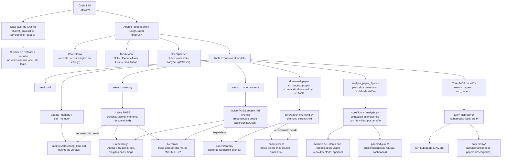

# AInstein

Un agente de investigación de IA 100% local. Corre sobre modelos de [Ollama](https://ollama.com) y/o de HuggingFace que ya tengas instalados en local — los mismos modelos que quizás ya uses para otros proyectos de IA local — sin llamadas a APIs externas ni claves de pago.

Este proyecto está en desarrollo activo — este documento refleja lo que hay implementado y probado hoy, no una visión final.

Dos apps complementarias opcionales, cada una su propio servidor local de Streamlit — separadas de este chat y entre sí a propósito, no páginas de un mismo dashboard grande:

**Dashboard de observabilidad**: métricas turno a turno, gráficos de uso/éxito de tools, comparación de modelos, actividad en el tiempo. `streamlit run observability/dashboard.py` (puerto 8020) — [http://localhost:8020](http://localhost:8020) una vez corriendo.

**Grafo de conocimiento**: un grafo 3D interactivo de papers/autores/topics extraído de la memoria a largo plazo. `streamlit run memory/graph_app.py` (puerto 8030) — [http://localhost:8030](http://localhost:8030) una vez corriendo.

Las dos tienen un botón directo en la propia cabecera del chat en cuanto están corriendo (ver `header_links` en `.chainlit/config.toml` — "Observability Dashboard" y "GraphRAG").

## Tabla de contenidos

- [Objetivo](#objetivo)
- [Visión](#visión)
- [Estado actual](#estado-actual)
- [Arquitectura](#arquitectura)
- [Tools](#tools)
- [Stack técnico](#stack-técnico)
- [Requisitos previos](#requisitos-previos)
- [Instalación](#instalación)
- [Configuración del chat](#configuración-del-chat)
- [Estructura del proyecto](#estructura-del-proyecto)
- [Cómo funciona la memoria](#cómo-funciona-la-memoria)
- [Cómo funciona el RAG sobre el contenido de los papers](#cómo-funciona-el-rag-sobre-el-contenido-de-los-papers)
- [Integración con arXiv](#integración-con-arxiv)
- [Por qué construimos el pipeline de papers nosotros mismos](#por-qué-construimos-el-pipeline-de-papers-nosotros-mismos)
- [Limitaciones conocidas](#limitaciones-conocidas)
- [Roadmap](#roadmap)

## Objetivo

Construir un asistente de investigación personal capaz de buscar, recuperar y razonar sobre papers académicos (empezando por arXiv), recordando el contexto de una línea de investigación activa entre sesiones — todo corriendo por completo en la máquina del usuario, sobre los modelos que elija y ya tenga instalados, sin que ningún dato de investigación salga nunca del dispositivo.

Más allá del propio asistente, este proyecto existe para aprender de verdad — de forma práctica, no solo en teoría — a:

- Gestionar MCPs "públicos" en local, y lidiar con que suelen tener más bugs y estar menos pulidos que los cerrados, protegidos por API key.
- Gestionar memoria en un entorno local, tanto a corto plazo (estado de la conversación) como a largo plazo (persistente, estructurada, buscable).
- Aprender a gestionar y crear memory graphs en entornos locales.
- Construir pipelines de RAG sobre distintos tipos de estructura subyacente, no solo sobre un único formato de contenido fijo.
- Aprender de primera mano las limitaciones reales de los modelos pequeños en local — peor uso de herramientas, peores respuestas, bucles infinitos con las tools, etc. — en vez de asumir que un modelo más grande simplemente haría desaparecer el problema.
- Gestionar la trazabilidad/observabilidad de modelos — en este proyecto en concreto en local, pero el planteamiento debería ser extrapolable más allá de entornos locales.
- Construir un pipeline de análisis multimodal de documentos. El OCR (vía Tesseract) recupera texto de PDFs escaneados/sin capa de texto, y `analyze_paper_figures` describe figuras/diagramas/gráficas embebidas con un modelo de visión local, cuando hay uno disponible — ver [Tools](#tools). Ambas son capacidades opcionales, auto-detectadas, no configuración obligatoria.
- Gestionar una estructura de repositorio para almacenar correctamente documentos externos (los papers, en este caso) a través de sus etapas debidas — raw, procesado, etc. — en vez de meterlo todo en un único bloque plano.
- Construir un conjunto de skills para el análisis práctico de papers, con la posibilidad de personalizar las estrategias usadas, ya que distintos usuarios pueden querer centrarse en cosas distintas de un paper — `paper-analysis` (modos de profundidad quick/standard/extended) cubre esto; ver [Tools](#tools).

## Visión

Un agente de investigación personal que:

- Busca y descarga papers de arXiv bajo demanda.
- Mantiene un repositorio local de los papers ya encontrados/analizados.
- Responde preguntas citando fragmentos concretos de esos papers (RAG sobre el contenido real, no solo sobre metadatos).
- Recuerda entre sesiones el tema de investigación activo, las preferencias del usuario y los papers relevantes ya vistos.
- Corre enteramente en local — sin depender de APIs de pago, sin enviar datos a terceros.

## Estado actual

| Pieza | Estado |
|---|---|
| Chat local con Ollama (chainlit + langchain/langgraph) | ✅ Implementado |
| Agente vía `deepagents` (`create_deep_agent`), con control fino de qué tools ve el modelo | ✅ Implementado |
| Sistema de skills (progressive disclosure) | ✅ Implementado — 3 skills de flujo de trabajo (`memory-management`, `arxiv-research`, `citation-tracking`) más `paper-analysis`, una skill de análisis de contenido con profundidad ajustable (quick/standard/extended, etiquetado hecho-vs-interpretación) adaptada de dos skills públicas con licencia MIT — ver [Tools](#tools) y [Objetivo](#objetivo). `paper-analysis` en concreto se verificó en vivo en 5 rondas contra `qwen3.5:4b`, encontrando y arreglando dos peculiaridades reales de modelos pequeños por el camino — ver [Limitaciones conocidas](#limitaciones-conocidas). |
| Memoria de conversación persistente (checkpointer SQLite) | ✅ Implementado |
| Sidebar de historial de chats + reanudar conversaciones anteriores | ✅ Implementado (data layer de Chainlit, SQLite; un único usuario local, sin pantalla de login) |
| Auto-resumen de conversación para no saturar el contexto | ✅ Implementado |
| Memoria a largo plazo editable (preferencias, tema activo, papers) | ✅ Implementado |
| RAG sobre la memoria a largo plazo (FAISS + reranker) | ✅ Implementado |
| Catálogo de modelos locales (Ollama + caché de HuggingFace) | ✅ Implementado |
| Manejo de errores con mensajes cortos al usuario | ✅ Implementado |
| Registro de métricas por turno (tokens, tiempos, tools usadas) | ✅ Implementado |
| Panel de observabilidad (comparar métricas entre ejecuciones/modelos) | ✅ Implementado — app de Streamlit separada (`observability/`): tabla de turnos, gráficos de uso/éxito de tools, comparación de modelos, actividad en el tiempo (ver introducción arriba) |
| Grafo de conocimiento (papers/autores/topics, 3D interactivo) | ✅ Implementado — app de Streamlit separada (`memory/graph_app.py`), construida a partir de `memory/knowledge_graph.py` (ver introducción arriba) |
| Cache de construcción del agente (no se reconstruye entero en cada mensaje) | ✅ Implementado |
| Búsqueda y lectura de papers de arXiv (vía MCP) | ✅ Implementado |
| Descarga de papers de arXiv | ✅ Implementado — en proceso propio (`core/arxiv_download.py`), no vía MCP; ver [Tools](#tools) |
| Repositorio local de papers descargados | ✅ Implementado (`papers/raw/`, escrito por `download_paper`) |
| RAG sobre el contenido de los papers | ✅ Implementado — chunking jerárquico parent/child (`core/paper_chunking.py`) + búsqueda FAISS/reranker sobre los child chunks, expandidos a los parent chunks para el contexto (`search_paper_content`); ver [Cómo funciona el RAG sobre el contenido de los papers](#cómo-funciona-el-rag-sobre-el-contenido-de-los-papers) |
| Multimodal — OCR (imagen → texto para PDFs escaneados/sin capa de texto) | ✅ Implementado (opcional) — OCR con Tesseract, integrado en `pymupdf4llm` y usado de forma transparente cuando está disponible |
| Multimodal — análisis de figuras/diagramas | ✅ Implementado (opcional) — `analyze_paper_figures` extrae las figuras embebidas vía `fitz` y las describe con un modelo de visión local de Ollama, auto-detectado cuando hay uno disponible. Verificado en vivo de extremo a extremo contra un paper real y un modelo real (`qwen3.5`) — ver [Limitaciones conocidas](#limitaciones-conocidas) para un bug real de modo `reasoning` que esto sacó a la luz y se arregló. |
| Grafo de memoria (relaciones entre papers/temas) | ⏳ Pendiente |
| Ejecución de modelos de HuggingFace (más allá de catalogarlos) | ⏳ Pendiente (embeddings sí, generación de texto no) |

## Arquitectura


```mermaid
flowchart TD
    UI["Chainlit UI<br/>(app.py)"] --> Agent["Agente (deepagents / LangGraph)<br/>graph.py"]
    UI --> DataLayer["Data layer de Chainlit<br/>chainlit_data.sqlite (core/chainlit_data.py)"]
    DataLayer --> History["Sidebar de historial + reanudar<br/>un único usuario local, sin login"]

    Agent --> LLM["ChatOllama<br/>(modelo de chat elegido en Settings)"]
    Agent --> MW["Middleware<br/>Skills · ExcludeTools · EnsureFinalAnswer"]
    Agent --> CKPT["Checkpointer<br/>checkpoints.sqlite (AsyncSqliteSaver)"]

    Agent --> Tools["Tools expuestas al modelo"]
    Tools --> ReadSkill["read_skill"]
    Tools --> UpdateMem["update_memory / edit_memory"]
    Tools --> SearchMem["search_memory"]
    Tools --> SearchPaperContent["search_paper_content"]
    Tools --> AnalyzeFigures["analyze_paper_figures<br/>(solo si se detecta un modelo de visión)"]
    Tools --> ArxivTools["Tools MCP de arXiv<br/>search_papers · read_paper · ..."]
    Tools --> CustomDownload["download_paper<br/>en proceso propio (core/arxiv_download.py), no MCP"]

    SearchMem --> FAISS["Índice FAISS<br/>(reconstruido en memoria desde el .md)"]
    FAISS --> Embeddings["Embeddings<br/>Ollama o HuggingFace, elegidos en Settings"]
    FAISS --> Reranker["Reranker<br/>cross-encoder/ms-marco-MiniLM-L6-v2"]

    SearchPaperContent --> ChildFAISS["Índice FAISS sobre child chunks<br/>(reconstruido desde papers/child/*.jsonl)"]
    ChildFAISS --> Embeddings
    ChildFAISS --> Reranker
    ChildFAISS -. expande a .-> ParentDir["papers/parent/<br/>(texto de los parent chunks)"]

    UpdateMem --> MDFile["memory/store/long_term.md<br/>(fuente de verdad)"]
    FAISS -. reconstruido desde .-> MDFile

    CustomDownload --> Chunking["core/paper_chunking.py<br/>chunking parent/child"]
    Chunking --> ParentDir
    Chunking --> ChildDir["papers/child/<br/>(texto de los child chunks, embebido)"]
    ChildFAISS -. reconstruido desde .-> ChildDir

    AnalyzeFigures --> FigureExtract["core/figure_analysis.py<br/>extracción de imágenes con fitz + filtro por tamaño"]
    FigureExtract --> VisionModel["Modelo de Ollama con capacidad de visión<br/>auto-detectado, opcional"]
    FigureExtract --> FiguresDir["papers/figures/<br/>(descripciones de figuras, cacheadas)"]

    ArxivTools --> MCP["arxiv-mcp-server<br/>(subproceso local, stdio)"]
    MCP --> ArxivAPI["API pública de arXiv.org"]
    MCP --> PapersDir["papers/raw/<br/>(almacenamiento de papers descargados)"]
```

El modelo **nunca** tiene acceso a herramientas genéricas de filesystem (`read_file`, `write_file`, `edit_file`, `ls`, `glob`, `grep`, `execute`) ni a subagentes (`task`) — se ocultan explícitamente vía `ExcludeToolsMiddleware`. Todo lo que el modelo puede leer o escribir pasa por tools acotadas a propósito (`read_skill`, `update_memory`, `edit_memory`, `search_memory`), cada una limitada a una carpeta o archivo concreto.

## Tools

| Tool | Para qué sirve | Notas |
|---|---|---|
| `read_skill(skill_name, file_name="SKILL.md")` | Lee las instrucciones completas de una skill, o un archivo de apoyo que referencie. | Acotada a `skills/<skill_name>/` — no puede leer nada fuera de ahí. Skills: `memory-management`, `arxiv-research`, `citation-tracking`, `paper-analysis`. |
| `update_memory(content, category)` | Añade una entrada nueva a la memoria a largo plazo. | `category` es una de `preference`, `research_topic`, `keyword`, `paper`, `note`. Solo toca `memory/store/long_term.md`. |
| `edit_memory(entry_id, content=None, category=None, delete=False)` | Reemplaza, corrige o borra una entrada existente de memoria. | Afecta a exactamente una entrada, localizada por id — nunca reescribe el resto del archivo. |
| `search_memory(query, k=5)` | Búsqueda semántica sobre la memoria a largo plazo. | Recupera hasta 15 candidatos vía FAISS, los reordena con un cross-encoder, devuelve los `k` mejores. |
| `search_paper_content(query, paper_id=None, k=5)` | Búsqueda semántica sobre el texto completo de los papers descargados — no solo abstracts. | Busca sobre los child chunks vía FAISS + reranker, devuelve sus parent chunks (sin duplicados), cada uno etiquetado con título/autores/arXiv id del paper. Se puede restringir a un paper concreto con `paper_id`. Ver [Cómo funciona el RAG sobre el contenido de los papers](#cómo-funciona-el-rag-sobre-el-contenido-de-los-papers). |
| `search_papers(query, max_results, date_from, date_to, categories, sort_by)` | Busca en arXiv por palabras clave/filtros. | Tool MCP de arXiv. Limitada a 3 segundos entre llamadas por política de arXiv. |
| `get_abstract(paper_id)` | Trae el abstract y metadatos de un paper sin descargarlo. | Tool MCP de arXiv. |
| `download_paper(paper_id, start, max_chars)` | Descarga el texto completo de un paper (fuente LaTeX preferida por su estructura real de secciones, luego HTML, y PDF como último recurso) a `papers/raw/`, y lo trocea en parent/child chunks para `search_paper_content`. | Corre en nuestro propio proceso (`core/arxiv_download.py`), no a través del servidor MCP — se comprobó que el viaje de ida y vuelta por MCP para esta tool en concreto podía tardar minutos, o colgarse indefinidamente, incluso cuando la misma lógica de descarga/conversión ejecutada directamente termina en menos de un minuto. |
| `read_paper(paper_id, start, max_chars)` | Lee un paper previamente guardado con `download_paper`. | Tool MCP de arXiv. |
| `analyze_paper_figures(paper_id)` | Extrae y describe las figuras/diagramas/gráficas embebidas en el PDF de un paper, usando un modelo local con capacidad de visión. | Solo presente cuando se auto-detecta un modelo de Ollama con capacidad de visión (`core/figure_analysis.py`); descarga su propia copia del PDF sin importar qué formato usó `download_paper` para el texto. Resultados cacheados en `papers/figures/<paper_id>.jsonl`. |
| `list_papers()` | Lista todos los papers descargados hasta ahora. | Tool MCP de arXiv. |
| `citation_graph(paper_id)` | Papers que citan a uno dado, y a los que ese paper cita. | Tool MCP de arXiv, vía Semantic Scholar. |
| `watch_topic(topic, categories, max_results)` | Guarda una búsqueda de arXiv persistente para vigilar papers nuevos. | Tool MCP de arXiv. |
| `check_alerts(topic)` | Comprueba las búsquedas guardadas en busca de papers publicados recientemente. | Tool MCP de arXiv. |

**Explícitamente ocultas al modelo**: `ls`, `read_file`, `write_file`, `edit_file`, `glob`, `grep`, `execute`, `task` — las tools genéricas de filesystem y de lanzamiento de subagentes que `deepagents` registra por defecto (ver [Arquitectura](#arquitectura)).

## Stack técnico

- **UI / servidor de chat**: [Chainlit](https://chainlit.io)
- **Orquestación del agente**: [LangGraph](https://langchain-ai.github.io/langgraph/) + [`deepagents`](https://github.com/langchain-ai/deepagents) (middleware de skills, memoria, resumen automático y filesystem)
- **LLM local**: [Ollama](https://ollama.com) vía `langchain-ollama`. Se evaluaron modelos locales de HuggingFace como segunda opción de modelo de chat, pero no están soportados todavía — ver [Limitaciones conocidas](#limitaciones-conocidas).
- **Embeddings**: `OllamaEmbeddings` o `HuggingFaceEmbeddings` (`langchain-huggingface` + `sentence-transformers`), configurable por sesión
- **Vector store**: [FAISS](https://github.com/facebookresearch/faiss) (`faiss-cpu`, local, sin servidor)
- **Reranker**: `cross-encoder/ms-marco-MiniLM-L6-v2` vía `langchain_community.cross_encoders.HuggingFaceCrossEncoder`
- **Chunking de papers**: `RecursiveCharacterTextSplitter` de `langchain-text-splitters`, dimensionado por número real de tokens vía `tiktoken` (`cl100k_base`), no por una aproximación de caracteres
- **Persistencia de conversación**: SQLite (`langgraph-checkpoint-sqlite` + `aiosqlite`)
- **Catálogo de modelos**: cliente python `ollama` (capabilities, context length) + `huggingface_hub` (caché local de HF)
- **Integración con arXiv**: [`arxiv-mcp-server`](https://github.com/blazickjp/arxiv-mcp-server) (servidor MCP local, instalado vía `uv`) + `langchain-mcp-adapters` para exponer sus tools al agente
- **Observabilidad**: métricas por turno registradas en SQLite (`observability/metrics_store.py`) — sin panel/interfaz todavía, ver [Roadmap](#roadmap)

## Requisitos previos

- Python 3.11+ (probado en 3.13)
- [Ollama](https://ollama.com) instalado y corriendo (`ollama serve`)
- Al menos un modelo de chat con soporte de tool calling descargado, ej.:
  ```bash
  ollama pull llama3.2
  ```
- Al menos un modelo de embeddings descargado para poder usar `search_memory`, ej.:
  ```bash
  ollama pull mxbai-embed-large
  ```
- [`uv`](https://docs.astral.sh/uv/) instalado — el servidor MCP de arXiv (con su extra `pdf`, necesario para leer papers) se descarga automáticamente la primera vez que se usa vía `uv tool run`, sin ningún paso de instalación manual.
- Espacio en disco para las descargas automáticas la primera vez que se usan: el reranker (~90MB) y, si se elige un modelo de embeddings de HuggingFace, `sentence-transformers`/`torch` ya deben estar instalados (ver más abajo) más el propio modelo.
- Acceso a red la primera vez que se descarga un paper, para obtener el encoding `cl100k_base` de `tiktoken` (un par de MB) usado para dimensionar los chunks por número de tokens — se cachea en local después, no vuelve a hacer falta.
- **Opcional**: [Tesseract OCR](https://github.com/tesseract-ocr/tesseract) instalado, con `TESSDATA_PREFIX` (apuntando a su carpeta `tessdata`) puesto en `.env` junto a `CHAINLIT_AUTH_SECRET`. Solo hace falta para el caso raro de un paper de arXiv sin LaTeX/HTML y cuyo PDF es un escaneo sin capa de texto real — `pymupdf4llm` ya trae soporte de OCR con Tesseract integrado y lo usa de forma completamente transparente en cuanto puede encontrar Tesseract así; sin ello, ese caso concreto sigue devolviendo texto vacío en silencio, igual que antes.
- **Opcional**: un modelo de Ollama con capacidad de visión descargado (ej. `ollama pull llama3.2-vision` o `ollama pull qwen2.5vl`), para habilitar `analyze_paper_figures`. Auto-detectado — no hace falta ninguna otra configuración, y sin uno la tool simplemente nunca se añade, nada se rompe.

### Probado con

Cualquier modelo de Ollama con soporte de tool-calling debería funcionar, pero este proyecto se ha probado de extremo a extremo con:

- **Modelo de chat principal**: `qwen3.5` — usado para la mayoría de las pruebas, incluida la verificación de descarga de papers y persistencia de memoria descrita en este README.
- **Modelo de embeddings**: `mxbai-embed-large`
- **Modelo local pequeño**: `llama3.2:1b` / `llama3.2:3b` — usado para poner a prueba el middleware de robustez (`EnsureFinalAnswerMiddleware`, tolerancia en los argumentos de las tools, `PaperMemoryMiddleware`) frente a un modelo mucho más propenso a respuestas vacías y llamadas a herramientas mal formadas que el principal. `llama3.2:3b` en concreto también está hardcodeado como modelo de fallback de segundo nivel dentro del propio `EnsureFinalAnswerMiddleware` (ver más abajo) — no es solo un modelo usado para probar.
- **Modelo de visión**: `qwen3.5` (ya tiene capacidad de visión — no hace falta un modelo aparte) y `moondream` — ambos confirmados funcionando de extremo a extremo con `analyze_paper_figures` contra un paper real descargado. `qwen3.5` en concreto sacó a la luz un bug real (ver [Limitaciones conocidas](#limitaciones-conocidas): los modelos con capacidad de razonamiento necesitan `reasoning=False`, o una figura compleja puede volver con una descripción vacía en silencio).

## Instalación

```bash
python -m venv .venv
.venv\Scripts\activate      # Windows
pip install -r requirements.txt
chainlit create-secret       # una vez: pega el CHAINLIT_AUTH_SECRET impreso en un archivo .env
ollama serve                # si no está ya corriendo
chainlit run app.py
```

`CHAINLIT_AUTH_SECRET` es requerido por Chainlit para habilitar el sidebar de historial de chats (ver `core/chainlit_data.py`) — sin él, `chainlit run` falla al arrancar. Es un secreto puramente local; no se envía a ningún sitio.

## Configuración del chat

Ajustes disponibles en la barra lateral de Chainlit:

| Ajuste | Qué hace |
|---|---|
| **Model** | Modelo de chat de Ollama. Solo se listan modelos con capability `completion` (los de embeddings, como `mxbai-embed-large`, no aparecen aquí). |
| **Embedding Model** | Modelo usado por `search_memory`. Incluye modelos de embeddings de Ollama (capability `embedding`) y de HuggingFace (detectados por la presencia de `modules.json` en la caché local — compatibilidad con sentence-transformers), listados juntos por nombre — de qué backend viene cada modelo se resuelve internamente y no se muestra en el desplegable. |
| **Temperature** | Temperatura de generación del modelo de chat. |
| **Memory** | Si está activado, el agente recuerda los mensajes anteriores de esta conversación (vía checkpointer) — y al reutilizar el propio thread id de Chainlit, reanudar esta conversación más tarde desde el sidebar de historial continúa el mismo estado del agente, no solo la transcripción. Si está desactivado, cada mensaje arranca sin contexto previo. |
| **Streaming** | Muestra la respuesta token a token en vez de esperar al final. |

Ollama carga un modelo en memoria la primera vez que se usa en un rato, lo cual puede tardar un minuto o más sin ningún progreso visible — fácil de confundir con que la app se ha quedado colgada. Se muestra un mensaje "⏳ Loading the model…" exactamente durante esa espera, y desaparece en cuanto llega contenido real (la primera tool call o el primer token de streaming).

Como esta app tiene un único usuario local, una sesión nueva (pestaña nueva, recarga de página, o una reconexión tras una espera larga y silenciosa) casi siempre significa que la anterior quedó abandonada, no una segunda conversación deliberada — así que iniciar un chat nuevo cancela automáticamente cualquier mensaje que se siguiera procesando en el anterior, en vez de dejarlo corriendo sin que nadie lo vea, compitiendo por el mismo request a Ollama.

## Estructura del proyecto

```
.
├── app.py                     # Entrypoint de Chainlit: UI, settings, manejo de errores
├── graph.py                   # Construcción del agente (deepagents/LangGraph), checkpointer
├── core/
│   ├── tools.py                # Tools de propósito general: read_skill
│   ├── arxiv_download.py        # download_paper — en proceso propio (no MCP), ver Tools más abajo
│   ├── paper_chunking.py        # ensure_paper_chunks — chunking parent/child para search_paper_content
│   ├── figure_analysis.py       # analyze_paper_figures — extracción de figuras (fitz) + descripción con modelo de visión, opcional
│   ├── middleware.py            # ExcludeToolsMiddleware, ForcePaperAnalysisSkillMiddleware, EnsureFinalAnswerMiddleware, PaperMemoryMiddleware, ArxivTimeoutMiddleware (propios)
│   ├── chainlit_data.py          # Data layer de Chainlit sobre SQLite (sidebar/reanudar) + auth solo local
│   ├── ollama_functions.py      # Catálogo de modelos Ollama (capabilities, context length) + métricas LLM
│   └── huggingface_functions.py # Catálogo de la caché local de HuggingFace
├── prompts/
│   ├── research_agent_prompt.py     # SYSTEM_PROMPT — identidad/comportamiento base del agente
│   ├── skills_prompt.py             # Prompt del sistema de skills (SkillsMiddleware)
│   ├── memory_prompt.py             # Plantilla de prompt de la memoria a largo plazo
│   ├── arxiv_prompt.py              # Prompt de las tools de arXiv (incluye el aviso de contenido no confiable)
│   └── ensure_final_answer_prompt.py # NUDGE_MESSAGE_TEMPLATE / FALLBACK_MESSAGE / FALLBACK_MODEL_UNAVAILABLE_MESSAGE (EnsureFinalAnswerMiddleware)
├── memory/
│   ├── memory_tools.py        # update_memory / edit_memory — memoria a largo plazo + helpers de metadatos de papers
│   ├── memory_rag.py          # search_memory — FAISS + embeddings + reranker
│   ├── paper_rag.py            # search_paper_content — FAISS + reranker sobre child chunks, expansión a parent
│   ├── knowledge_graph.py     # Construye memory/store/graph.sqlite desde long_term.md (autores, coautoría, categorías arXiv, keywords vía KeyBERT, aristas de similitud por embeddings) — se ejecuta con `python -m memory.knowledge_graph`
│   ├── graph_app.py            # App de Streamlit independiente: grafo de conocimiento 3D interactivo (3d-force-graph) — su propio servidor, ver introducción arriba
│   └── store/                 # Datos generados: long_term.md, graph.sqlite (versionado — se mantiene como dato de ejemplo real, no está en gitignore)
├── skills/                    # memory-management/, arxiv-research/, citation-tracking/, paper-analysis/ (progressive disclosure vía read_skill)
├── observability/
│   ├── metrics_store.py       # log_turn — métricas por turno (tokens, tiempos, tools usadas, num_ctx, reasoning)
│   ├── _shared.py              # Carga de datos + filtros de la barra lateral, compartidos entre dashboard.py y pages/
│   ├── dashboard.py            # Entrypoint de Streamlit: página "Turns" — su propio servidor, ver introducción arriba
│   ├── pages/                  # Tool Charts, Model Comparison, Activity Over Time (multi-página de Streamlit)
│   └── metrics.sqlite         # Datos generados (no versionar)
├── papers/                    # Versionado — se mantiene como dato de ejemplo real, no está en gitignore
│   ├── raw/                    # Papers descargados, texto completo
│   ├── parent/                 # Parent chunks, ~1200 tokens cada uno, un .jsonl por paper
│   ├── child/                  # Child chunks, ~350 tokens cada uno, embebidos para search_paper_content
│   └── figures/                 # Descripciones de figuras, un .jsonl por paper (solo si hay un modelo de visión disponible)
├── checkpoints.sqlite         # Estado de conversación persistido (versionado — se mantiene como dato de ejemplo real, no está en gitignore)
├── chainlit_data.sqlite       # Historial de chats para el sidebar (versionado — se mantiene como dato de ejemplo real, no está en gitignore)
├── .env                       # CHAINLIT_AUTH_SECRET (no versionar, nunca commitear)
└── requirements.txt
```

## Cómo funciona la memoria

Hay dos sistemas de memoria independientes, que resuelven problemas distintos:

**Memoria de conversación (corto plazo)** — un checkpointer de LangGraph (`AsyncSqliteSaver`) persiste el estado completo del grafo (mensajes, tool calls, resultados) indexado por `thread_id`. Un `SummarizationMiddleware` resume automáticamente el historial antiguo cuando se acerca al `num_ctx` real del modelo elegido, para no desbordar el contexto.

**Memoria a largo plazo (entre sesiones)** — vive en `memory/store/long_term.md`. Cada entrada tiene un id estable, una categoría (`preference`, `research_topic`, `keyword`, `paper`, `note`) y un timestamp, delimitada por marcadores HTML que el modelo no ve (se eliminan antes de inyectarse en el prompt) pero que permiten a las tools localizar y editar una entrada exacta. El modelo solo ve un índice ligero (id + categoría + timestamp) en el system prompt — para leer el contenido completo llama a `search_memory`, que:

1. Recupera hasta 15 candidatos de un índice FAISS por similitud de embeddings.
2. Los reordena con un cross-encoder reranker (más preciso que la similitud sola).
3. Devuelve los `k` mejores (por defecto 5).

El índice FAISS es un caché derivado que se reconstruye en memoria cuando cambia `long_term.md` — nunca se persiste a disco, así que no hay riesgo de que se desincronice de la fuente de verdad.

## Cómo funciona el RAG sobre el contenido de los papers

`search_memory` solo cubre *abstracts* de papers (vía `PaperMemoryMiddleware`) — nunca ve el texto realmente descargado. `search_paper_content` sí, usando un esquema de chunking jerárquico (parent/child) en vez de un único índice plano:

1. Cada vez que `download_paper` tiene éxito, `core/paper_chunking.py` trocea el texto completo en **parent chunks** (~1200 tokens, con algo de solapamiento) y, dentro de cada uno, en **child chunks** (~350 tokens, con algo de solapamiento) — dimensionados por número real de tokens (`tiktoken`, `cl100k_base`), no por caracteres. Se escriben una sola vez como `papers/parent/<paper_id>.jsonl` y `papers/child/<paper_id>.jsonl` (un chunk por línea); un paper ya troceado nunca se vuelve a trocear.
2. `search_paper_content` embebe y busca sobre los **child** chunks (suficientemente pequeños para una búsqueda por similitud precisa), reordena los candidatos con el mismo cross-encoder que usa `search_memory`, y luego **expande cada child superviviente a su parent chunk** — lo bastante amplio para ser un contexto útil de verdad — eliminando duplicados para que los child chunks vecinos de un mismo parent solo generen un bloque.
3. Cada bloque devuelto lleva delante una cabecera de cita corta (arXiv id, título, autores) sacada de los mismos metadatos que `PaperMemoryMiddleware` ya guarda en `memory/store/long_term.md` — no se almacenan una tercera vez.

Igual que el índice FAISS de la memoria a largo plazo, el índice sobre child chunks es un caché derivado que se reconstruye en memoria (desde `papers/child/*.jsonl`) cuando cambia el contenido de esa carpeta o el modelo de embeddings — `papers/parent/`/`papers/child/` son los artefactos duraderos, el índice en sí no se persiste a disco.

## Integración con arXiv

El acceso a arXiv lo da [`arxiv-mcp-server`](https://github.com/blazickjp/arxiv-mcp-server), un servidor [MCP](https://modelcontextprotocol.io) local lanzado como subproceso (`uv tool run arxiv-mcp-server`, transporte stdio) y conectado vía `langchain-mcp-adapters`. Sin API key — la API de arXiv es pública y gratuita.

Tools expuestas al modelo: `search_papers`, `get_abstract`, `download_paper` (en proceso propio, no MCP — ver [Tools](#tools)), `read_paper`, `list_papers`, `citation_graph` (vía Semantic Scholar), `watch_topic`/`check_alerts` (monitorización persistente de temas), más la propia `search_paper_content` (ver [Cómo funciona el RAG sobre el contenido de los papers](#cómo-funciona-el-rag-sobre-el-contenido-de-los-papers)). Los papers descargados se guardan en `papers/raw/`, en la raíz del proyecto. El `semantic_search`/`reindex` propios del servidor MCP se excluyen deliberadamente — ver [Limitaciones conocidas](#limitaciones-conocidas).

**Seguridad**: el texto de un paper es contenido externo que el agente no ha elegido y no puede verificar — un paper podría contener texto adversario diseñado para parecer una instrucción. El propio servidor MCP ya marca los resultados como `[EXTERNAL CONTENT]`, y el system prompt del agente le dice explícitamente que trate el texto de los papers como datos sobre los que informar, nunca como órdenes a seguir. Es el mismo límite de "fuente de instrucciones" que se aplica a cualquier otro input no confiable.

El conjunto de tools MCP se obtiene una sola vez (de forma perezosa, en el primer uso) y se reutiliza durante toda la vida del proceso — no se vuelve a conectar en cada mensaje.

## Por qué construimos el pipeline de papers nosotros mismos

Existen herramientas públicas y de propósito general de conversión de documentos que en teoría podrían cubrir parte de lo que hacen `core/arxiv_download.py` y `core/paper_chunking.py` — [MarkItDown](https://github.com/microsoft/markitdown) (Microsoft) es un buen ejemplo: conversión local de PDF/Office/imágenes/audio a markdown, con un enganche opcional para llamar a un LLM de visión (cualquier cliente compatible con OpenAI, incluido un endpoint local de Ollama) para describir imágenes embebidas.

Decidimos deliberadamente no adoptarla, ni a ella ni a una herramienta parecida, para el pipeline de papers:

- **No tiene ninguna noción de los formatos de envío propios de arXiv.** Nuestra ruta LaTeX-first (extracción segura de tar/gzip, puntuación del fichero principal, aplanado de `\input`/`\include` — ver [Integración con arXiv](#integración-con-arxiv)) existe específicamente para recuperar la estructura real de secciones de un paper a partir de su fuente original, algo que un conversor genérico no puede ni intentar — solo ve el PDF o el HTML ya renderizados, nunca el LaTeX en sí.
- **La salida de una herramienta genérica no sabe nada de nuestro pipeline posterior.** Todo lo que produce `download_paper` va directo al chunking parent/child de `core/paper_chunking.py` y luego al índice RAG de `search_paper_content` — un blob de markdown de una sola pasada de un conversor externo no está pensado para eso, y adaptarlo bien significaría desmontar su salida de todas formas.
- **La mayor parte de lo que soporta una herramienta genérica es peso muerto aquí.** La conversión de DOCX/PPTX/XLSX/audio/EPub — la mayor parte de la superficie real de MarkItDown — es irrelevante para papers de arXiv; añadir toda una dependencia nueva para el ~10% que sí usaríamos no compensa cuando ya tenemos las piezas (`fitz`/PyMuPDF, ya una dependencia vía `pymupdf4llm`) para construir esa porción concreta nosotros mismos.

Lo único que hace una herramienta como MarkItDown que va más allá del texto plano —describir figuras/diagramas/gráficas con un LLM de visión, no solo hacer OCR del texto de un escaneo— ahora está construido de la misma manera: `analyze_paper_figures` (`core/figure_analysis.py`) extrae las imágenes embebidas directamente con `fitz` (ya disponible) y las describe con un modelo de visión local de Ollama, en vez de adoptar una herramienta genérica para una capacidad tan concreta. Tampoco es solo una decisión técnica — construir el pipeline nosotros mismos, no solo conectar uno ya existente, es precisamente el objetivo de este proyecto (ver [Objetivo](#objetivo)).

## Limitaciones conocidas

- **Modelos locales pequeños son poco fiables con secuencias de tool calls complejas** — se ha observado que modelos como `llama3.2:latest` (3B) a veces pasan argumentos con formato incorrecto (ej. un texto donde el schema de la tool MCP exige estrictamente un entero), o alucinan llamadas a herramientas. `EnsureFinalAnswerMiddleware` garantiza que el turno nunca termine en blanco — primero volviendo a pedir respuesta al propio modelo seleccionado (hasta 2 intentos), luego, si sigue sin responder, reintentando con un modelo de fallback pequeño y fijo (`llama3.2:3b`, hasta 2 intentos), y solo entonces cayendo a un mensaje fijo — pero nada de esto corrige errores de razonamiento del modelo a mitad de turno (una tool call mal formada sigue fallando igual). Modelos locales más grandes (ej. `cogito:8b`) han sido notablemente más fiables en las pruebas, incluso con las tools MCP de arXiv — pero "modelo más grande" no es un arreglo universal: ver la comparativa cruzada de `citation_graph` más abajo, donde `cogito:8b` salió peor que `qwen3.5:4b` en una pregunta concreta, no mejor. Una variante más grave que un valor de argumento mal formado: se ha observado a `qwen3.5:4b` generar una tool call con sintaxis XML mal formada (una etiqueta de apertura `<function>` cerrada con `</parameter>`) que ni el propio Ollama puede parsear — esto falla como un HTTP 500 del propio endpoint `chat()` de Ollama (`ollama._types.ResponseError: XML syntax error...`), no como un "input de tool inválido" gestionable con gracia por la capa de schema, y se propaga como excepción sin capturar por todos los middlewares de la pila (ninguno envuelve la llamada `model.ainvoke()` subyacente). El `except Exception` amplio de `app.py` alrededor del procesamiento de mensajes sí contiene esto en la app real — el turno falla con un mensaje de error corto y amigable en vez de tumbar la app — pero el fallo de generación de fondo no es algo que un cambio de prompt o de skill pueda prevenir.
- **Las skills necesitan un disparador explícito y literal para que realmente se usen** — que una skill exista y esté bien formada no significa que un modelo local pequeño la busque por su cuenta. La descripción de `paper-analysis` originalmente sonaba natural ("entender, resumir, evaluar... un paper concreto"), pero `qwen3.5:4b` nunca llamó a `read_skill` para ella; solo al reescribir la descripción con las frases literales que un usuario realmente escribiría ("give me a quick take / TL;DR", "is this worth reading") empezó a dispararse de forma fiable. Escribe las descripciones de las skills en torno a frases reales, no a paráfrasis de ellas.
- **El descubrimiento proactivo de skills necesita un empujón fuerte en el system prompt, y aun así el modelo lee la skill sin seguirla del todo — y para una forma de prompt concreta, ni siquiera una regla endurecida bastó, así que la skill ahora se inyecta por código en vez de esperar a que la pida.** Con el texto original y educado ("comprueba si existe una skill"), `qwen3.5:4b` llamaba a `read_skill` para un "resume este paper" quizá 1 de cada 4 veces (ni el idioma del prompt ni las frases-trigger literales cambiaron nada — simplemente no tenía el hábito). Reescribir `CUSTOM_SKILLS_SYSTEM_PROMPT` para que "escanea la lista de skills y `read_skill` la que aplique" sea una *primera acción* obligatoria explícita, con ejemplos concretos, consiguió que `read_skill` se dispare de forma consistente para la mayoría de prompts. Pero dispararla no es lo mismo que obedecerla: incluso tras leer `paper-analysis`, el modelo de 4B se saltaba igualmente la convención insignia de la skill (etiquetar cada afirmación como **(paper states)** vs **(interpretation)**) y a veces omitía la sección de "limitaciones que el paper reconoce". Un modelo pequeño trata una skill como orientación laxa, no como una spec — las partes que necesitan cumplimiento exacto (etiquetado, estructura) son las menos fiables. Para una forma de prompt recurrente ("dame un *extended analysis* de..." nombrando otros dos papers), incluso una regla dura y específica por palabra clave en `CUSTOM_SKILLS_SYSTEM_PROMPT` ("si el mensaje contiene 'analysis'/'analyze', `read_skill` es tu primera acción literal, sin excepciones") falló dos veces seguidas — `read_skill` nunca se llamó ninguna de las dos veces, y el turno cayó en el patrón indisciplinado de lectura completa redundante que la skill existe para evitar. Misma lección que `PaperMemoryMiddleware` (guardar papers automáticamente en vez de confiar en que se llame a `update_memory`): para algo tan crítico, dejar de esperar que el modelo siga una instrucción de texto y forzarlo por código. `ForcePaperAnalysisSkillMiddleware` (`core/middleware.py`) detecta "analysis"/"analyze" en el mensaje del usuario por regex e inyecta el texto completo de la skill como `SystemMessage` directamente — sin depender de que se llame a `read_skill`. Verificado en vivo: el contenido de la skill llega al modelo de forma fiable con este método (confirmado porque el etiquetado **(paper states)**/**(interpretation)** por fin apareció), pero una escalada adicional — decirle también al modelo, como un hecho ya resuelto, qué modo de profundidad ("quick"/"standard"/"extended") implica la redacción del propio usuario — no logró vencer de forma fiable el fuerte tirón del modelo hacia la plantilla más concreta y explícita de 5 puntos del modo Quick, frente a las instrucciones bastante más sueltas de Extended ("añade `citation_graph` y `search_memory`"). Aceptado como techo conocido para este tamaño de modelo: la skill en sí ahora está garantizada, pero qué profundidad elige dentro de ella no — y una respuesta equivocada-pero-igualmente-correcta-y-útil (Quick en vez de Extended) se consideró que no merecía una escalada mayor (pre-ejecutar `citation_graph`/`search_memory` por código y entregar sus resultados ya hechos, en vez de un modo que el modelo elige).
- **Los modelos pequeños no respetan las gradaciones de profundidad de una skill sin límites duros** — `paper-analysis` ofrece modos quick / standard / extended. Al pedirle el "veredicto rápido de 1 minuto", `qwen3.5:4b` leyó la skill, y luego leyó el paper *entero* y escribió un informe completo multi-sección igualmente — un análisis "standard" con otro nombre. El lenguaje suave ("brevemente", "una línea por punto", "esto es un veredicto, no un informe") no bastó; hizo falta poner restricciones duras explícitas en la skill (prohibición tajante de `read_paper`/`download_paper` en ese modo, número fijo de bullets, tope de palabras) para que la salida encajara con el modo.
- **Un modelo pequeño puede *describir* una tool call / siguiente paso en su texto en vez de emitirla** — verificado con `qwen3.5:4b` en varias formas: prosa ("let me retrieve the next chunk before providing analysis") seguida de un bloque ```json {"tool_name": "read_paper", "args": {…}}```; o `{"task": "continue_reading_paper", "description": "…"}`; o solo un "Let me continue reading the paper." pelado — cada una termina el turno porque el `AIMessage` no tiene `tool_calls` reales. El chequeo "¿esta respuesta final está vacía?" de `EnsureFinalAnswerMiddleware` (`_looks_like_textual_tool_call` en `core/middleware.py`) ahora trata todas ellas como no-respuestas que necesitan el camino de reintento/nudge: un blob JSON con claves de tool call (`tool_name`/`args`) *o* de acción descrita (`task`/`action`/`next_step`/…), y prosa corta que solo anuncia más trabajo ("let me continue/retrieve/read…", "before providing analysis"). Se mantiene conservador — una respuesta real que solo cite algo de JSON, o que mencione "leer" trabajo previo, no se caza.
- **Las preguntas de síntesis multi-fuente pueden meter a un modelo pequeño en un bucle de `search_paper_content`, o en una narración de "sigo paginando `read_paper`"** — al pedirle "explica la idea central de LoRA *y* conéctala con la atención" en un turno, `qwen3.5:4b` hizo variablemente: emitir una tool call fingida (arriba), narrar la paginación de `read_paper` sin responder, o lanzar 13 queries casi idénticas de `search_paper_content` antes de converger. Dos cosas ayudan: la skill `arxiv-research` / `ARXIV_PROMPT` ahora dirigen las preguntas de "explica / cómo se relaciona X con Y" hacia `search_paper_content` (o `read_paper` con `return_full_text=true`) y prohíben explícitamente narrar la paginación; y dividir la pregunta en turnos de un solo foco ("explica LoRA" → luego "ahora conéctalo con la atención") funciona de forma fiable donde el turno combinado no. El camino con bucle solo converge porque `recursion_limit` ahora es 50 — con 25 topaba el techo a mitad de bucle.
- **Una tool call fallida puede quedar sustituida en silencio por la salida de otra tool, presentada como si respondiera a la pregunta original** — verificado en vivo: Semantic Scholar rate-limita `citation_graph` en la práctica (HTTP 429, incluso con reintentos/backoff ya implementados), y dos veces seguidas `citation-tracking` ni siquiera se consultó (`read_skill` nunca se llamó, pese a que su descripción ya contiene la frase casi exacta del usuario — el descubrimiento proactivo de skills fallando incluso con un empujón fuerte del system prompt y una buena descripción, ver arriba). Cuando `citation_graph` falló del todo, `qwen3.5:4b` no le dijo al usuario que había fallado — en su lugar hizo en silencio una búsqueda de palabra clave `search_papers` para "QLoRA" y escribió un informe entero con total confianza (tablas categorizadas, una "línea temporal de publicación" con cifras anuales sospechosamente redondas) *como si* eso fuera el grafo de citas. Una búsqueda de palabra clave de papers *sobre* un tema no es lo mismo que los papers que lo *citan*, y presentar uno como el otro es una tergiversación real, no una alternativa razonable. Arreglado con una regla explícita (en `citation-tracking` y generalizada en `ARXIV_PROMPT`): cuando cualquier tool call falle o devuelva un estado que no sea de éxito, decirlo claramente — nunca sustituir por la salida de otra tool y presentarla como si satisficiera la petición original.
- **El grafo de citas de un paper muy citado puede ser demasiados datos para un modelo pequeño, y una deflexión enlatada de "no veo tu pregunta" tras una llamada a la tool que SÍ tuvo éxito era un bug distinto y más duro que todo lo anterior — ya arreglado de raíz, no solo parcheado.** `citation_graph(max_citations=50)` sobre QLoRA (5.583 citas) devuelve ~82.000 caracteres de JSON anidado (50 citas + 50 referencias), la misma clase de desbordamiento que causa el LaTeX crudo multi-página en otro sitio; `citation-tracking` usa `max_citations=10` por defecto. Eso ayudó pero no lo arregló del todo: en 5 intentos separados, `qwen3.5:4b` respondió a una llamada EXITOSA de `citation_graph` con una no-respuesta enlatada negando tener nada con qué trabajar — con redacción distinta cada vez ("no hay ningún resultado que resumir... esto es una conversación nueva", "me has pedido que responda sin llamar a ninguna tool", "no veo tu mensaje más reciente en el historial de la conversación"). La misma deflexión también apareció en un turno de análisis extendido sin relación que había reunido resultados reales de `search_paper_content`, y se verificó que era independiente del ajuste `reasoning` (reproducida tanto con `True` como con `False`) — descartándolo como causa. **Causa raíz, encontrada al leer de cerca el propio bucle de reintento de `EnsureFinalAnswerMiddleware`:** `NUDGE_MESSAGE` se reinyectaba como un `HumanMessage` plano diciendo "el mensaje más reciente del usuario de arriba es la pregunta" — pidiéndole al modelo hacer una búsqueda implícita de varios saltos hacia atrás entre varios pares de tool call/resultado para encontrar la pregunta real y distinguirla de esta misma meta-instrucción (inyectada también como `HumanMessage`). Fallaba esa búsqueda siempre, concluyendo "no veo ningún mensaje" en vez de encontrar el que tenía justo encima. **Arreglo**: `NUDGE_MESSAGE_TEMPLATE` ahora cita la pregunta original real del usuario literalmente dentro del propio nudge (capturada una sola vez al principio del bucle de reintento, antes de que se añada ningún nudge, para que nunca pueda citar accidentalmente un nudge anterior en vez de la pregunta real) — no queda nada que buscar. Combinado con un nuevo chequeo `_is_deflection_despite_data` (mismo patrón que el detector de tool-call-como-texto de arriba) que reconoce esta familia de negaciones enlatadas — "no veo ningún resultado/pregunta/mensaje", "cómo puedo ayudarte" — específicamente cuando ya existe un resultado real de tool antes en la conversación, y lo devuelve al camino de reintento en vez de aceptarlo como respuesta final válida. **Verificado en vivo en 6 retests tras el arreglo: 0/6 reprodujo la deflexión**, incluidas 2 respuestas limpias, completas e idénticas (temp=0) construidas enteramente a partir de los datos reales de `citation_graph`.
- **El éxito de una tool no impide que un modelo pequeño re-derive la misma respuesta de forma redundante y más lenta** — un segundo fallo relacionado salió a la luz al dejar de estar tapado por la deflexión de arriba: tras una llamada EXITOSA a `citation_graph`, `qwen3.5:4b` a veces llamaba igualmente a `download_paper`/`read_paper`/`search_paper_content`, paginando por los ~97.000 caracteres de LaTeX completo del paper buscando patrones `\citep{}` para reconstruir una bibliografía — más lento y menos fiable que los datos estructurados de la propia tool de citas, y suficiente contexto extra sobre todo lo demás ya reunido como para que la respuesta final se cortara a media frase. Arreglado con una prohibición explícita y contundente en `citation-tracking` (nunca seguir `citation_graph` — éxito o fallo — con una lectura de texto completo) y una redirección equivalente añadida a la propia descripción de `arxiv-research` y a su guía de `search_paper_content` (ya que se observó en vivo que un `read_skill('arxiv-research')` disparado por error en vez de `citation-tracking` mandaba al modelo de vuelta a este mismo patrón, sin ninguna de las reglas nuevas en su contexto).

**Probar esa misma pregunta con `cogito:8b` lo empeoró, no lo mejoró** — una sorpresa genuina dado el mejor historial de `cogito:8b` en el resto del proyecto (arriba). Dos veces, de forma determinista (salida idéntica ambas veces a temperatura 0), `cogito:8b` no hizo NINGUNA llamada a tool — ni `citation_graph`, ni siquiera `search_papers` — y en su lugar respondió desde memoria paramétrica con una lista de citas completamente fabricada, con total confianza: un paper titulado "QLoRA: Efficient Fine-Tuning of Pre-Trained Language Models" de "Guo et al. (2023)" (el título real es "QLoRA: Efficient Finetuning of Quantized LLMs" de Dettmers, Pagnoni, Holtzman y Zettlemoyer — no hay ningún autor llamado Guo involucrado), el mismo título falso repetido dos veces bajo encabezados distintos en la misma respuesta. No es un problema de capacidad — `ollama show cogito:8b` confirma `tools` entre sus capacidades declaradas — es una elección de comportamiento que este modelo hizo para esta pregunta concreta. Entre los dos modos de fallo, el de `qwen3.5:4b` es más honesto (falla en responder en vez de responder mal); el de `cogito:8b` es más peligroso precisamente porque se lee como una respuesta completa, segura y bien formateada. La lección: "usa un modelo más grande" no es un arreglo universal y hay que verificarlo por escenario, no asumirlo a partir del historial del modelo en otras tareas.
- **Los modelos pequeños no suprimen fiablemente un concepto solo porque lo niegues** — encontrado en vivo depurando `paper-analysis`: una versión temprana le decía explícitamente al modelo "no hay ningún campo llamado `summary`, no lo busques" (para evitar que alucinara un campo inexistente tras `get_abstract`) — reproducible 3/3 veces, el modelo seguía fallando igual, aparentemente "cebado" por la propia palabra repetida más que corregido por la negación alrededor. Reescribir la instrucción sin mencionar la palabra ni una sola vez (solo "usa el campo `abstract` directamente") lo arregló al instante. Si un modelo pequeño se queda fijado en algo, quitar la palabra disparadora del todo puede funcionar mejor que explicar por qué no aplica.
- **El docstring de una tool pesa tanto como la skill que la envuelve** — el parámetro `category` de `update_memory` estaba documentado como `"preference" (how you should behave)` / `"research_topic" (active research topic)`, ambos lo bastante ambiguos como para que `qwen3.5:4b`, llamando a la tool directamente sin haber leído antes `memory-management`, archivara "el usuario está empezando a estudiar mecanismos de atención" bajo `preference` en vez de `research_topic`. Un modelo puede llamar a una tool directamente desde su schema sin leer la skill que se supone que lo guía — así que el propio docstring de la tool tiene que desambiguar por sí solo, con ejemplos contrastivos, no solo el fichero de la skill.
- **Los propios nodos de middleware de `deepagents` también cuentan para `recursion_limit`** — `create_deep_agent()` fija `recursion_limit: 9999` vía `.with_config(...)`, pero ese valor por defecto no sobrevive a un `config=` explícito pasado en la llamada (verificado en vivo: sin fijarlo explícitamente, un turno real chocó con el valor por defecto de LangGraph, 25). Peor aún, cada ronda de tool calls cuesta ~5 pasos de grafo, no 2, porque `deepagents` añade sus propios nodos `before_agent`/`after_model` (`PatchToolCallsMiddleware`, `TodoListMiddleware`) encima de `model`/`tools` — así que 25 eran solo ~5 rondas reales de presupuesto, agotadas por un turno de investigación multi-paper razonablemente modesto. `app.py` ahora pasa `recursion_limit: 50` explícitamente (~10 rondas).
- **El contenido LaTeX crudo de un paper puede hacer que un modelo pequeño "complete" el documento en vez de responder a la pregunta** — verificado en vivo, dos veces: primero el modelo respondió ofreciéndose a editar/reformatear el LaTeX descargado ("If you'd like me to: 1. Add missing sections..."); tras añadir un aviso al *principio* del contenido, en vez de eso empezó a escribir su propia continuación inventada del paper, en el mismo registro LaTeX del original (una sección "Conclusion" alucinada con afirmaciones técnicas inventadas, presentadas como reales). Un aviso solo al principio de un documento largo se diluye para cuando el modelo empieza a generar justo después de él — arreglado repitiendo el recordatorio también *después* del contenido (`_CONTENT_WARNING_FOOTER` en `core/arxiv_download.py`), justo donde el sesgo de recencia del modelo sí que pesa.
- **Un mensaje con dos preguntas distintas puede acabar respondiendo solo a la más pesada en tools, ignorando la otra en silencio** — verificado en vivo: al preguntar "¿en qué he estado investigando últimamente? *Y* explícame por qué QLoRA cuantiza a 4 bits", `qwen3.5:4b` llamaba primero a `search_memory` (recuperando datos reales y correctos sobre la investigación del usuario), y luego escribía una respuesta que saltaba directo a explicar QLoRA sin referenciar ni una vez lo que `search_memory` acababa de devolver — la segunda pregunta, más fácil y más cargada de tools, desplazaba a la primera. Arreglado con una regla explícita en `SYSTEM_PROMPT`: cuando un mensaje tiene más de una pregunta distinta, responderlas todas, y comprobar la respuesta contra el mensaje original antes de terminar en vez de dejar que la última parte respondida sea la única. **Verificado en vivo tras el arreglo**: el mismo prompt (hilo nuevo, genuinamente sin contexto previo) produjo una respuesta con una sección explícita "What You've Been Researching" fundamentada en la entrada real recuperada de memoria, seguida de la explicación de QLoRA — ambas mitades respondidas, sin cortarse. (Una limitación residual de las tools implicadas, no de este arreglo: la sección de memoria solo mostró la entrada que la query de búsqueda casualmente encontró, no todo el hilo de investigación del usuario — una respuesta real y fundamentada, solo más estrecha de lo ideal.)
- **El acceso concurrente al mismo hilo de conversación puede bloquear el checkpointer de SQLite sin error ni timeout** — encontrado durante pruebas: dos procesos manejando el mismo `thread_id` contra `checkpoints.sqlite` pueden dejar a uno bloqueado permanentemente esperando el lock de escritura del otro, indistinguible de que el propio modelo esté atascado (sin uso de CPU, sin entrada en `ollama ps`, sin excepción — solo silencio durante el tiempo que se espere). La conexión por defecto de `aiosqlite` no tiene `busy_timeout`, así que el bloqueo por defecto de SQLite permite que esto se cuelgue indefinidamente en vez de lanzar `database is locked` rápido. Arreglado con `PRAGMA busy_timeout = 15000` en la conexión del checkpointer (`graph.py`) — un conflicto de acceso concurrente real ahora falla rápido con un error claro y capturable en vez de colgarse en silencio.
- **La calidad de retrieval depende mucho del modelo de embeddings y el tamaño del corpus** — con pocas entradas en memoria, la similitud pura puede rankear mal (por eso se añadió el reranker). Con corpus muy pequeños el reranker ayuda pero no es infalible.
- **La memoria a largo plazo solo puede crecer** — `update_memory`/`edit_memory` no auto-consolidan ni resumen entradas antiguas; a día de hoy no hay ningún proceso que las pode automáticamente.
- **Ejecución de modelos de HuggingFace limitada a embeddings** — el catálogo detecta cualquier modelo cacheado, pero solo hay ejecución implementada para modelos de embeddings compatibles con sentence-transformers. Los modelos de chat/generación de HF no son seleccionables, y esto no es solo algo pendiente de implementar: se evaluó el wrapper `ChatHuggingFace` de `langchain-huggingface` y su backend local sin servidor (`HuggingFacePipeline`) no soporta tool-calling multi-turno en absoluto — verificado leyendo su código fuente (`_to_chatml_format` falla con un `ToolMessage`, y `_to_chat_prompt` nunca pasa `tools=` al chat template). Como todo el diseño de este agente depende de las tool calls (arXiv, memoria, etc.), eso es un bloqueo real del backend local de la librería tal cual viene, no algo que se arregle con un parche rápido. Se consideró construir un adaptador propio de tool-calling sobre `transformers` directamente, y se descartó deliberadamente — fuera de alcance por ahora.
- **Sin sandboxing de ejecución de código** — no hay tool `execute` habilitada, así que esto no aplica hoy, pero si se reactiva en el futuro no hay aislamiento de proceso.
- **El `semantic_search`/`reindex` propios del servidor MCP se quitaron a propósito**, no solo se dejaron sin usar — solo indexan el abstract corto de cada paper (nunca el texto completo descargado), no admiten filtro por autor/categoría/fecha, y duplican lo que `search_memory` ya cubre sobre esos mismos abstracts (vía `PaperMemoryMiddleware`), sin reranker. El RAG real sobre el contenido completo de los papers (troceado, sobre el texto real) ahora lo cubre `search_paper_content` — ver [Cómo funciona el RAG sobre el contenido de los papers](#cómo-funciona-el-rag-sobre-el-contenido-de-los-papers).
- **Los tamaños de chunk de los papers son fijos, no adaptativos** — todos los papers se trocean con los mismos tamaños parent/child de ~1200/~350 tokens sin importar su propia estructura (ej. los límites reales de sección de un paper no se usan para alinear los bordes de los chunks), y los chunks, una vez escritos, nunca se regeneran aunque cambie la lógica de chunking más adelante — solo borrando `papers/parent/`/`papers/child/` (o los `.jsonl` de un paper concreto) y volviendo a ejecutar `download_paper` se aplica un esquema nuevo.
- **El fallback de OCR para PDFs escaneados es por documento completo, no por página** — la ruta de PDF (último recurso, tras fallar LaTeX y HTML) depende del soporte de OCR con Tesseract ya integrado en `pymupdf4llm`, que solo se activa de forma transparente si Tesseract está instalado y es localizable (ver [Requisitos previos](#requisitos-previos)); un paper con capa de texto real en algunas páginas y escaneadas en otras seguirá sin aplicar OCR a esas páginas concretas, solo a papers sin ninguna capa de texto en absoluto.
- **Los modelos de visión con capacidad de razonamiento necesitan `reasoning=False`, o pueden devolver una descripción vacía en silencio** — verificado en vivo con `qwen3.5` (que resulta tener capacidad de visión): en una figura compleja, su comportamiento por defecto de "pensar" internamente ("thinking") consumió todo el presupuesto de tokens de salida razonando antes de llegar a escribir la respuesta — la llamada tiene éxito (sin excepción, `status: success`), pero `content` vuelve vacío (el `done_reason` de `response_metadata` era `"length"`, no `"stop"` — fácil de pasar por alto). `core/figure_analysis.py` pone `reasoning=False` en la llamada `ChatOllama` de visión para evitar esto; no hace nada (no-op) en modelos de visión que ni siquiera tienen modo de razonamiento.
- **El mismo ajuste `reasoning` importa también para el modelo de chat principal, y su modo de fallo ahí es peor que una respuesta vacía** — verificado en vivo: con `reasoning` en su valor por defecto (`qwen3.5:4b` decidiendo por su cuenta), una petición de análisis de paper con varias partes se descarriló por completo, dos veces seguidas — en vez de analizar el paper pedido, el modelo lanzó una llamada a `search_papers` sobre un tema totalmente ajeno (nada en el prompt ni en la conversación lo sugería) y analizó con total confianza lo que esa búsqueda devolvió. Poner `reasoning=False` en la instancia principal de `ChatOllama` en `graph.py` (antes solo se ponía en la llamada de visión) paró esto — repetido 2 veces más en hilos nuevos, el modelo se mantuvo en el tema ambas veces. Es un trade-off real, no gratis: desactiva el "thinking" extendido para todo el chat, no solo para este fallo, así que puede costar calidad en prompts que sí se benefician de razonar más — y no lo arregla todo: un bucle distinto de paginación en `read_paper` (quedarse repitiendo los mismos dos bloques cerca del final de un paper largo) pasó una vez con `reasoning=False` puesto, en un turno donde el modelo no había consultado la skill `paper-analysis` (ver la limitación de descubrimiento de skills de arriba) y por tanto no sabía preferir `search_paper_content`.
- **Una tool oculta al modelo aún se puede *llamar* — la protección real está en otro sitio, y aguantó** — comprobado directamente tras ver una llamada alucinada y malformada a `read_file` (una tool nunca mostrada al modelo, al estar en `HIDDEN_TOOLS`/excluida vía `ExcludeToolsMiddleware`): `ExcludeToolsMiddleware` solo filtra lo que se envía al modelo en su lista de tools para esa petición, no quita la tool del grafo en sí, así que una entrada de `tool_calls` que nombra una tool excluida no se rechaza solo por estar excluida. Probado directamente (inyectando una tool call sintética a `read_file`, sin pasar por el modelo): el propio mecanismo de interrupción de filesystem de `deepagents` (`_fs_interrupt.py`) la interceptó y canceló antes de ejecutarse — no se llegó a leer ningún contenido real de archivo. La protección real aquí es esa capa de interrupción, no `ExcludeToolsMiddleware`, que es más un filtro de UX/consistencia (mantener estas tools fuera de las opciones del modelo) que una barrera de seguridad por sí sola. Por separado, cuando esa llamada cancelada dejó al modelo sin nada, respondió fabricando con total confianza una descripción del contenido del archivo ("usa networkx... muestra grafos con matplotlib o pyvis") que no se parece en nada al archivo real — el mismo patrón de alucinación confiada ante el fallo silencioso de una tool ya documentado en otros puntos de esta lista. Que el camino de interrupción fuera la protección real resultó importar en la práctica, no solo en teoría: en un turno real, `qwen3.5:4b` llamó a `read_file` (sin que nadie lo pidiera, con argumentos incompletos) más de una vez, y el mecanismo de interrupción —pensado para que un humano lo resuelva— simplemente dejó el turno colgado sin nadie para resolverlo. `ExcludeToolsMiddleware` ahora también intercepta directamente una llamada a cualquier tool excluida (`wrap_tool_call`/`awrap_tool_call`), devolviendo un mensaje de error de tool claro en vez de llegar nunca a esa interrupción — verificado en vivo: un reintento del mismo escenario dio cero intentos de `read_file` convirtiéndose en cuelgue, frente a los 15+ de antes.
- **La extracción de figuras se filtra y limita de forma heurística** — se descartan imágenes de menos de 150px en cualquier dimensión (pensado para descartar iconos/logos, pero también podría descartar una figura genuinamente pequeña pero relevante), y como mucho se procesan 20 figuras por paper (un paper con muchísimas figuras no tendrá el resto descritas). Las imágenes extraídas tampoco se normalizan de formato — un formato embebido poco habitual se le pasa al modelo de visión tal cual, sin convertirlo antes a algo más estándar como PNG/JPEG.

## Roadmap

1. ~~Integración con arXiv (búsqueda y descarga de papers)~~ — hecho; búsqueda/lectura vía MCP, descarga en proceso propio (`core/arxiv_download.py`).
2. ~~Repositorio local de papers descargados~~ — hecho, escrito por `download_paper` en `papers/raw/`.
3. ~~RAG real sobre el contenido de los papers~~ — hecho; chunking jerárquico parent/child (`core/paper_chunking.py`) + búsqueda FAISS/reranker sobre child chunks (`search_paper_content`, `memory/paper_rag.py`), expandidos a parent chunks para el contexto, en vez de la búsqueda solo-abstract que ofrecía el `semantic_search` del servidor MCP (ya eliminado).
4. ~~Grafo de memoria~~ — hecho, un único grafo heterogéneo (no grafos separados por tipo de entidad — una pregunta como "¿de qué temas trata lo que ha escrito el autor X?" necesita atravesar `paper` en dos saltos, así que papers/autores/keywords comparten un solo grafo): `memory/knowledge_graph.py` lo construye a partir de `long_term.md` (autores + coautoría desde metadata de papers ya guardada, categorías de arXiv, keywords extraídos con KeyBERT, aristas de similitud por embeddings entre keywords en vez de una jerarquía impuesta por un modelo), visualizado como grafo 3D interactivo (`memory/graph_app.py`, su propia app de Streamlit — ver introducción arriba).
5. ~~Panel de observabilidad~~ — hecho, su propia app de Streamlit que visualiza las métricas por turno ya registradas (`observability/metrics_store.py`: tokens, latencia, tools usadas) — tabla de turnos, gráficos de uso/éxito de tools, comparación de modelos, actividad en el tiempo (ver introducción arriba).
6. ~~Skills para trabajar con papers~~ — hecho: `memory-management` (qué merece la pena guardar en memoria a largo plazo, evitando datos personales/identificativos innecesarios), `arxiv-research` (flujo de búsqueda/descarga/lectura, sintaxis de consultas), `citation-tracking` (`citation_graph`/`watch_topic`/`check_alerts`) — una skill por flujo de trabajo de herramientas — más `paper-analysis`, la skill de análisis de contenido que pedía originalmente el [Objetivo](#objetivo): modos de profundidad quick/standard/extended y etiquetado hecho-vs-interpretación, adaptada de dos skills públicas con licencia MIT (`paper-analyst` de flyer-li, `paper-reader-heilmeier` de realzyzhang) en vez de construida desde cero — ver [Tools](#tools).
7. ~~Análisis multimodal de documentos~~ — hecho, opcional: OCR (Tesseract, vía `pymupdf4llm`) para PDFs escaneados/sin capa de texto, y `analyze_paper_figures` (`core/figure_analysis.py`) para describir figuras/diagramas embebidos con un modelo de visión local, ambos auto-detectados en vez de requerir configuración. Verificado en vivo contra un paper real y un modelo de visión real (`qwen3.5`, que resulta ya tener capacidad de visión) — ver [Limitaciones conocidas](#limitaciones-conocidas) para un bug real que esto sacó a la luz y se arregló.
